<!---

Notes to myself

Revised slides by COB on Thursday.

Some examples early.
Spend a little more time in reviews.
Analysis of Means is an application of control charts where the data comes in clusters rather than in time order.
Show tables in a more generic format and less R centric format.
Add non-technical images.

Description of the data when displaying data. Not enough to just talk about it.
Remove the pound signs.
Animation
Too many formulas. Have some example data.
What is h?
Don’t assume what people know about sampling error or other terms (Bonferroni, Tukey).
Explain why it is so wide.

More of a hook at the beginning.
How does the control chart relate to everything else?

https://support.minitab.com/en-us/minitab-express/1/help-and-how-to/modeling-statistics/anova/how-to/one-way-anova/interpret-the-results/all-statistics-and-graphs/

https://commons.wikimedia.org/wiki/File:Paint_brush_dipped_in_blue_paint.jpg

https://commons.wikimedia.org/wiki/File:Paint_brushes_(Unsplash).jpg

https://static.wikia.nocookie.net/disney/images/8/8e/Mine.jpg/revision/latest/scale-to-width-down/432?cb=20070709214843

--->

```{r setup, echo=FALSE}
knitr::opts_chunk$set(
  echo=FALSE,
  message=FALSE,
  fig.width=7)
suppressMessages(
  suppressWarnings(
    library(tidyverse)))
```

### Introduction

+ Analysis of Means (ANOM)
  + Applications
    + Quality control
    + Institutional comparisons
+ Similar but different from ANOVA
+ Similar but different from control charts
+ ANOM advantages
  + Easy to calculate
  + Simple, interpretable conclusions

<div class="notes">

An Introduction to Analysis of Means

Analysis of Means (ANOM) is an underappreciated methodology that has relevance to quality control and institutional comparisons. Unlike Analysis of Variance (ANOVA), which compares one group mean to another group mean, ANOM compares each group mean to the overall mean. The calculations in ANOM are simple and direct. ANOM also avoids many of the ambiguities inherent in the multiple comparisons used in ANOVA, and avoids a common misinterpretation about overlapping confidence intervals. This talk will illustrate the mechanics of calculating ANOM and provide context for when you should or should not use it.

</div>

### Review: Analysis of Variance

+ $$H_0: \mu_i=\mu_j \ for \ all \ i, j$$
+ $$H_1: \mu_i \ne \mu_j \ for \ at  \ least \ one \ i, j$$
  + Reject $H_0$ if $F=\frac{MSTR}{MSE} > F(1-\alpha, k-1, N-k)$
  + Apply post hoc test (e.g., Tukey)
  
<div class="notes">

Let's review the basic Analysis of Variance hypotheses. Let's keep things simple. You have a continuous outcome measured n times in k groups. The null hypothesis is that the population mean is the same for each group. The alternative is that there is at least one pair i,j where the group means differ. You use an F statistic defined as the Mean Square Treatment divided by the Mean Square Error and compare it to a percentile of the F distribution. I won't go into the calculation any more other than to note that if you reject the null hypothesis, you typically apply a post hoc comparison, such as Tukey to identify which pair or pairs differ.

</div>

### Interpretation issues with ANOVA (1/4)

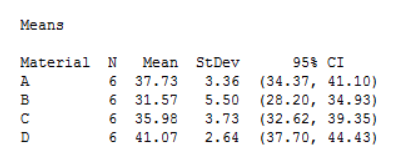

<div class="notes">

The interpretation of ANOVA models is tricky. Here is an example I am borrowing from a website, Statistics By Jim,

https://statisticsbyjim.com/anova/post-hoc-tests-anova/

The data represents strength measured for four different batches of materials. Notice how the individual confidence intervals for A and B just barely touch. You can see it better, perhaps on the following graph. You'd be tempted to say that there is no statistically significant difference between batches A and B, but you'd be wrong. The uncertainty associated with individual means does not translate in an additive sense to comparisons between two means. The standard errors are sub-additive, so  two intervals that are only lightly embracing would look different if you computed the confidence interval for the difference.

This is ignoring, of course, the issue of multiplicity, but the point is still important to note. The graphical display of individual means and confidence intervals can be misleading.

</div>

### Interpretation issues with ANOVA (2/4)

```{r touching-intervals}
x <- c(37.73, 31.57, 35.98, 41.07)
y <- 1:4
lo <- c(34.37, 28.20, 32.62, 37.70)
hi <- c(41.10, 34.93, 39.35, 44.43)

x <- c(14.733, 8.567, 12.983, 18.067)
y <- 1:4
lo <- c(11.369, 5.203, 9.619, 14.703)
hi <- c(18.097, 11.931, 16.347, 21.431)

data.frame(x=x, y=y) %>%
  ggplot(aes(x, y)) +
    expand_limits(x=c(0,30)) +
    geom_point() +
    ylab(" ") +
    geom_segment(x=lo, y=y, xend=hi, yend=y) +
    scale_y_continuous(
      breaks=1:4, 
      minor_breaks=NULL, 
      labels=LETTERS[1:4]) -> plotx
ggsave("images/anova-interpretation.png")
```

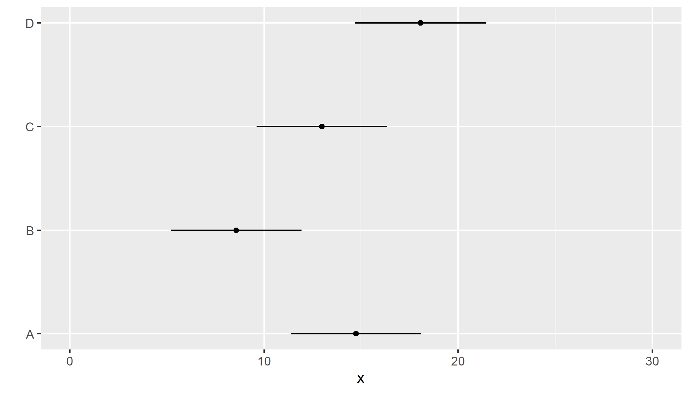

<div class="notes">

You'd be tempted to say that there is no statistically significant difference between batches A and B, but you'd be wrong. The uncertainty associated with individual means does not translate in an additive sense to comparisons between two means. The standard errors are sub-additive, so  two intervals that are only lightly embracing would look different if you computed the confidence interval for the difference.

This is ignoring, of course, the issue of multiplicity, but the point is still important to note. The graphical display of individual means and confidence intervals can be misleading.

</div>

### Interpretation issues with ANOVA (3/4)

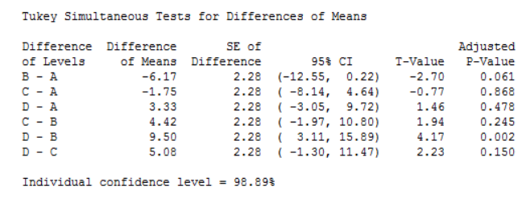

<div class="notes">

Here's another difficulty with interpretation in the ANOVA setting. These are intervals for the difference in means, using a Tukey post hoc adjustment.

</div>

### Interpretation issues with ANOVA (4/4)

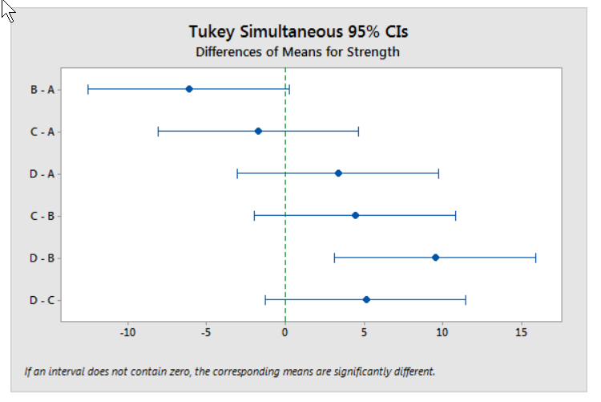
<div class="notes">

Here is a graphical display of these intervals.  Let's ignore C for the time being. Remember that B is the weakest material, D is the strongest, and A is somewhere in the middle. Looking at these intervals, there is no statistically significant difference between B and A, none between A and D, but there is a statistically significant difference between B and D.

Now I don't mean to harp on this point too much. ANOVA is a great technique. It often helps us greatly in understanding what is going on, in spite of these interpretation problems. But nothing is perfect in Statistics. There is at least some downside to everything that you try.

</div>

### Review: control charts (1/2)

```{r qc-example, }
suppressMessages(
  suppressWarnings(
    library(qcc)))
suppressMessages(
  suppressWarnings(
    library(tidyverse)))
data(pistonrings)
diameter = with(pistonrings, qcc.groups(diameter, sample))
q1 = qcc(diameter[1:25,], type="xbar", newdata=diameter[26:40,])
png("images/qcc-output.png", width=720, height=480)
plot(q1, chart.all=FALSE)
dev.off()
```

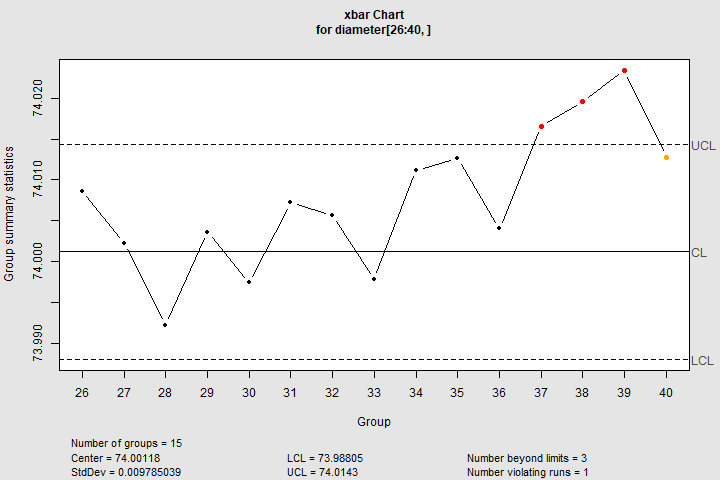

<div class="notes">

This slide shows an example of a control chart for means. The data represents piston ring diameters in an automotive factory. It's important to keep the diameters very very close to 74. The workers on the factory floor measure five diameters every day, compute the average (and the range and standard deviation) for that day and plot it over 40 consecutive days. The workers also measure short term variation, as computed by the range or standard deviation for each day.

Control limits are computed using the average standard deviation or the average range. You may have heard these called the three sigma limits, but you need to be careful, because "sigma" is not an overall standard deviation, but a short term estimate of variation.

</div>

### Review: control charts (2/2)

+ Out of control if:
  + One point outside of control limits
  + Eight consecutive points on same side of center line
  + Other rules(?)
  
<div class="notes">

The process is said to be out of control if you find one point out of the control limit or eight consecutive points on the same side of the center line.

There are other rules, such as two out three points outside the two sigma limits, four out of five outside the one sigma limits.

</div>

### A common mistake for control charts

```{r mistake}

worker_names <- c(
  "Dopey",
  "Doc",
  "Bashful",
  "Sneezy",
  "Happy",
  "Grumpy",
  "Sleepy",
  "Gimli")
average_ore_produced <- c(36, 25, 26, 10, 5, 29, 0, 20)
mn <- mean(average_ore_produced)
data.frame(workers=1:8, average_ore_produced) %>%
  ggplot(aes(workers, average_ore_produced)) +
  geom_line() +
  geom_hline(yintercept=mn) +
  geom_hline(yintercept=mn+3*5, linetype="dashed") +
  geom_hline(yintercept=mn-3*5, linetype="dashed") +
  scale_x_continuous(
    breaks=1:8, 
    minor_breaks=NULL, 
    labels=worker_names) -> plotx
ggsave("images/common-mistake.png", plot=plotx)
```

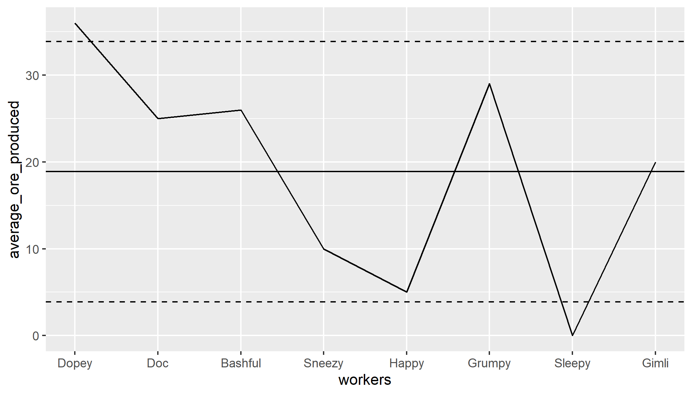

<div class="notes">

Here's a fictional chart showing ore production by eight dwarves. Most of you recognize the first seven names, but does anyone know who "Gimli" is?

This is drawn like a control chart and uses control chart limits, but it is not a correct application of control chart methodology.

</div>

### Why is this control chart bad?

+ Worker chart has an arbitrary order
  + Control charts rules depend on a time sequence
  + Rules optimized for average run length
+ Use ANOM chart instead

<div class="notes">

Most of the decision rules such as

* Eight consecutive points on same size of the centerline

* Two out of three outside two sigma limits

* Four out of five outside one sigma limits

are dependent on the ordering of the data.

But the ordering shown in the previous chart is arbitrary. You could have just as easily arranged the dwarfs names alphabetically and you would end up with the possibly a different interpretation.

</div>

### Stop here if there are questions

+ What you've seen
  + Review
    + ANOVA
    + Control charts
+ What's coming up
  + Framework for Analysis of Means

### The ANOM hypothesis

+ $$H_0: \mu_i=\mu \ for \ all \ i$$
+ $$H_1: \mu_i \ne \mu \ for \ at  \ least \ one \ i$$
  + Reject $H_0$ if $\left|\bar{Y}_{i.}-\bar{Y}_{..}\right| > h(1-\alpha, k, n(k-1)) S_p \sqrt{\frac{k-1}{kn}}$
  + No need to apply any post hoc test
  
<div class="notes">

This is the Analysis of Means hypothesis. I'm keeping things simple by assuming that there ar exactly lower-case n values in each of k groups.

You are comparing each mean to the overall mean. This is a slightly different approach than looking at pairs of means, as Analysis of Variance does.

</div>

### ANOM table

```{}
     I=2   3    4    5    6  
df=2 4.30 5.88 6.59 7.10 7.49
   3 3.18 4.18 4.60 4.92 5.14
   4 2.78 3.56 3.89 4.12 4.30
   5 2.57 3.25 3.52 3.72 3.88
   6 2.45 3.07 3.31 3.49 3.62
   7 2.36 2.94 3.17 3.33 3.46
   8 2.31 2.86 3.06 3.22 3.33
```

<div class="notes">

You need percentiles from a special distribution. You can find tables for this distribution in many places. Here's a small piece of a table that I produced a while back. You can find the full table at 

http://www.pmean.com/07/AnomTable05Part1.html

and 

http://www.pmean.com/07/AnomTable05Part2.html

If you are curious, here are a few details about how I generated this table. I cross checked it against several other tables, by the way.

You compute the critical value using a multivariate t-distribution. There are a few complications. First the distribution you are trying to describe represents deviations from an overall mean, so there will be correlations in the data since each group contributes to the overall mean. This correlation, -1/(I-1), is the same for any pair of deviations. Second, the sum of the deviations must equal zero, so this produces a degenerate distribution. This degeneracy means that there is no inverse for the correlation matrix.

In R, there is a library, mvtnorm, that will allow you to compute the percentiles needed for ANOM. Here's an example to get h(0.95, 5, 15):

i <- 5

co <- matrix(-1/(i-1), nrow=i, ncol=i)

diag(co) <- rep(1,i)

qmvt(p=0.95, tail="both.tails", corr=co, df=15)


</div>

### Stop here if there are questions

+ What you've seen
  + Framework for Analysis of Means
+ What's coming up
  + A simple example


### An example (1/2)

```{r deviations}
label_deviation <- c(
  -0.02386,-0.02853,-0.03001,-0.00428,-0.03623,
  -0.04222,-0.00144,-0.06466,0.00944,-0.00163,
  -0.02014,-0.02725,0.02268,-0.03323,0.03661,
  0.04378,0.05562,0.00977,0.05641,0.01816,
  -0.00728,0.02849,-0.04404,-0.02214,-0.01394,
  0.04855,0.03566,0.02345,0.01339,-0.00203,
  0.06694,0.10729,0.05974,0.06089,0.07551,
  0.03620,0.05614,0.08985,0.04175,0.05298,
  0.03677,0.00361,0.03736,0.01164,-0.00741,
  0.02495,-0.00803,0.03021,-0.00149,-0.04640,
  0.00493,-0.03839,-0.02037,-0.00487,-0.01202,
  0.00710,-0.03075,0.00167,-0.02845,-0.00697)
position <- rep(1:6, each=10)
cat("Position 1\n")
for (i in seq(1,9, by=2)) {
  cat(label_deviation[i:(i+1)])
  cat("\n")
}
```

<div class="notes">

This dataset comes from the SAS QC Guide. It represents deviations in label placement for a bottling machine. There are six different positions for this machine, and you want to find out if the deviations are substantially different for one or more positions.

The deviations for Position 1 are small but mostly negative. That means that the label is placed a bit too far to the left, on average.

</div>

### An example (2/2)

```{r deviations-2}
cat("Position 2\n")
for (i in seq(11,19, by=2)) {
  cat(label_deviation[i:(i+1)])
  cat("\n")
}
```

<div class="notes">

Here's the data for the second position. There is more of a mix here, and more positive than negative deviations.

I won't show the rest of the raw data, but here is a graph.

</div>

### Graph of the data

```{r initial-graph}
data.frame(position, label_deviation) -> d
d %>%
  ggplot(aes(position, label_deviation)) +
    geom_point() +
    scale_x_continuous(
      breaks=1:6,
      minor_breaks=NULL) -> g0
ggsave("images/label-graph-00.png", plot=g0)
```

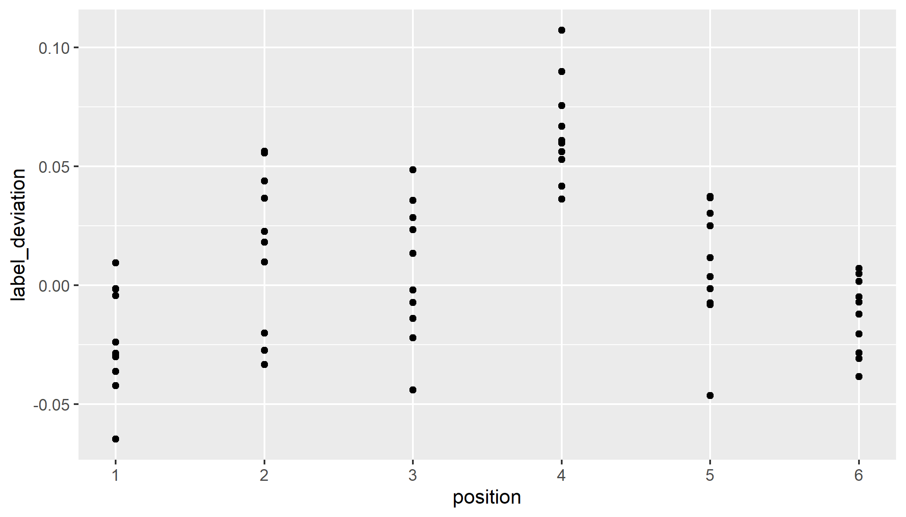

<div class="notes">

It looks like positions 1 and 6 are a bit too far to the left, position 4 is a bit too far to the right, and positions 2, 3, and 5 are somewhere in between. Do any of these differ from the overall mean?

</div>

### Summary statistics

```{r summary}
d %>%
  group_by(position) %>%
  summarize(
    avg=mean(label_deviation),
    stdev=sd(label_deviation)) -> su
su %>%
  mutate(avg=round(avg, 3)) %>%
  mutate(stdev=round(stdev, 3)) %>%
  data.frame
```

<div class="notes">

Here are the means and standard deviations for each position.

</div>

### Graph means

```{r graph-1}
su %>%
  ggplot(aes(x=position, y=avg)) +
    geom_point() + 
    scale_x_continuous(
      breaks=1:6,
      minor_breaks=NULL) -> g1
ggsave("images/label-graph-01.png", plot=g1)
```

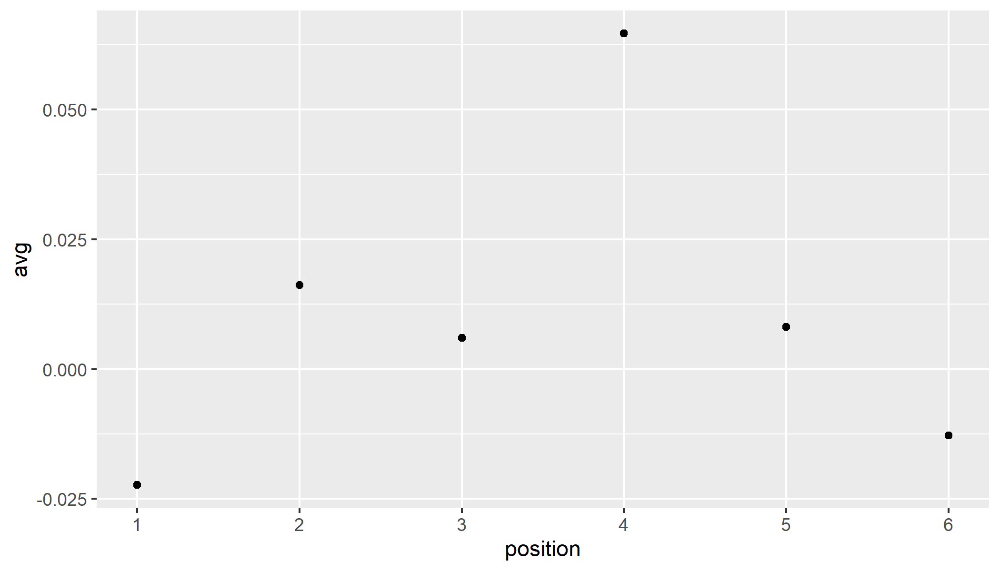

<div class="notes">

A plot of the position means shows a bit more clearly the pattern I mentioned earlier.

</div>

### Overall mean and pooled standard deviation

```{r overall}
su %>%
  mutate(v=stdev^2) %>%
  summarize(
    avg=mean(avg),
    v=mean(v)) %>%
  mutate(sp=sqrt(v)) %>%
  select(avg, sp) -> overall
overall %>%
  mutate(avg=round(avg, 3)) %>%
  mutate(sp=round(sp, 3)) %>%
  data.frame
h <- 2.72
```

<div class="notes">

The overall mean and the pooled standard deviation are computed used the standard formulas you learned in your STATS 101 class.

</div>

### Show deviation from overall mean

```{r graph-2}
g1 +
  geom_segment(
      aes(
        x=position, 
        y=overall$avg, 
        xend=position, 
        yend=avg)) +
  geom_hline(yintercept=overall$avg) -> g2
ggsave("images/label-graph-02.png", plot=g2)
```

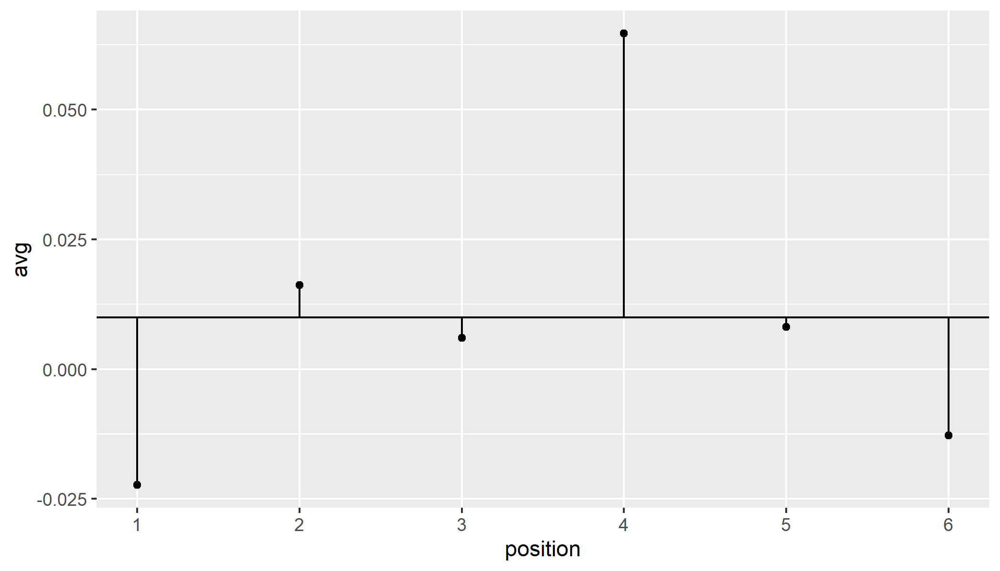

<div class="notes">

Draw a horizontal line at the overall mean and show the deviations from the overall mean as spikes.

</div>

### Calculate limits

```{r limits}
lo <- overall$avg-h*overall$sp*sqrt(5/60)
hi <- overall$avg+h*overall$sp*sqrt(5/60)
```

$\bar{Y}_{..} \pm h(1-\alpha, k, n(k-1)) S_p \sqrt{\frac{k-1}{kn}}{ }$

`r round(overall$avg, 3)` $\pm$ 2.72 `r round(overall$sp, 3)` $\sqrt{\frac{5}{60}}$

`r round(lo, 3)` to `r round(hi, 3)`

<div class="notes">

Here is the calculation of limits. Anything outside these limits is statistically significantly different than the overall mean.

</div>

### Add limits to the graph

```{r graph-3}
g2 +
  geom_hline(yintercept=lo) +
  geom_hline(yintercept=hi) -> g3
ggsave("images/plot-graph-03.png", plot=g3)
```

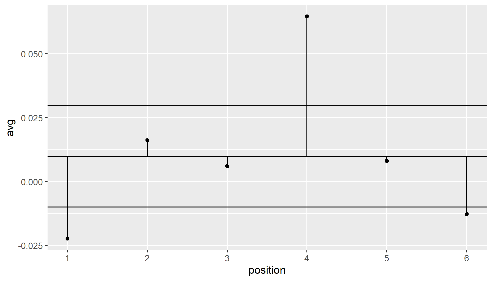

<div class="notes">

Here is the graph with the analysis of means limits. Your intuiton was correct. There are significant deviations to the left in positions 1 and 6 and a significant deviation to the right in position 4.

Now, why would we compare to the overall mean rather than to zero? It depends on the context, but on these assembly lines, there are adjustments that you can make to change the positioning of labels across all positions, and those adjusted will never help you here. Because any overall change to the labels is either going to make positions 1 and 6 worse, or position 4 worse. You need to make interior adjustments rather than global adjustements.

</div>

### Stop here if there are questions

+ What you've seen
  + A simple example
+ What's coming up
  + Extensions to proportions and counts

### Analysis of means for proportions

+ Two changes
  + Proportions rather than means
  + Unequal group sizes
  
+ Limits
  + $\bar p \pm m(1-\alpha, k, \infty) \sqrt{\bar p (1-\bar p)} \sqrt{\frac{N-n_i}{Nn_i}}$
  + IMPORTANT!!! Limits change with i
  
<div class="notes">

There are several possible extensions of the Analysis of Means model. A very interesting one appears in the same SAS reference. It involves a comparison of the probability of C-section births among a variety of different clinics.

You can use the normal approximation to the binomial distribution and instead of a pooled variance, you use the square root of p-bar times one minus p-bar.

The other extension is the unequal sample sizes. Some clinics only had 3 total births during the study time frame, and one clinic had almost a thousand births. You have to use a different table for unequal sample sizes. I don't have easy access to this table, but you can find it in a book by Nelson.

Peter R. Nelson, Peter S. Wludyka, Karen A. F. Copeland. The Analysis of Means. A Graphical Method for Comparing Means, Rates, and Proportions. ASA-SIAM Series on Statistics and Probability. Siam, Philadelphia PA, ASA, Washington DC, 2005. 

VERY IMPORTANT!!! There is a subscript i in this equation. That means that the limits vary in width. That's to be expected when you have unequal sample sizes.

</div>

### An example

```{r proportions}
x <- c(
  "1A",150,923,
  "1K",45,298,
  "1B",34,170,
  "1D",18,132,
  "3I",20,106,
  "3M",12,105,
  "1E",10,77,
  "1N",19,74,
  "1Q",7,69,
  "3H",11,65,
  "1R",11,49,
  "1H",9,48,
  "1C",8,43, 
  "3B",6,43, 
  "1M",4,29,
  "3C",5,28, 
  "1O",4,27, 
  "1J",6,22, 
  "1T",3,22,
  "3J",7,20,
  "3E",4,18, 
  "1G",4,15, 
  "3D",4,13, 
  "3G",1,11,
  "1L",2,10, 
  "1I",1,8, 
  "1P",0,3, 
  "1F",0,3,
  "1S",1,3)
x %>%
  matrix(ncol=3, byrow=TRUE) %>%
  data.frame %>%
  set_names(c("group", "c_sections", "births")) %>%
  mutate(c_sections=as.numeric(c_sections)) %>%
  mutate(births=as.numeric(births)) -> raw_data
head(raw_data)
```  

<div class="notes">

You can also use the analysis of means methods for proportions and counts. Here's an example of some proportion data. 

</div>
  
### Preliminary plot  

```{r p1}
raw_data %>%
  mutate(p=c_sections / births) -> c_section_rates
c_section_rates %>%
  summarize(
    c_sections=sum(c_sections),
    births=sum(births)) %>%
  mutate(pbar=c_sections/births) -> overall
pbar <- unlist(overall$pbar)

c_section_rates %>%
  ggplot(aes(x=1:29, y=p)) +
  geom_point() + 
  scale_x_continuous(
    breaks=1:29,
    minor_breaks=NULL,
    labels=c_section_rates$group) +
  geom_hline(yintercept=pbar) + 
  geom_segment(
    x=1:29, 
    y=rep(pbar, 29), 
    xend=1:29, 
    yend=c_section_rates$p) -> p1
ggsave("images/csection-01.png", plot=p1)
```  

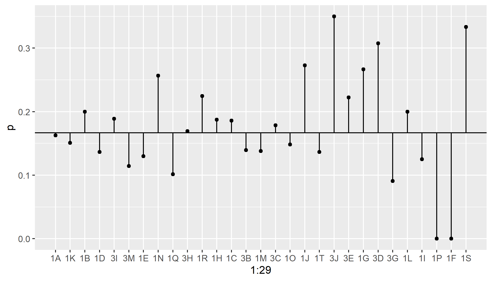

<div class="notes">

Here is a plot of the proportions. It looks like there are substantial deviations from the overall C-section rate, but here your initial intuition, if it was like mine, is incorrect.

</div>

### Plot limits

```{r p-limits}
library(mvtnorm)
i <- 29
co <- matrix(-1/(i-1), nrow=i, ncol=i)
diag(co) <- rep(1,i)
x <- qmvt(p=0.95, tail="both.tails", corr=co, df=5000)
m <- as.numeric(x[1])
lo <- 
  overall$pbar - 
   h*sqrt(overall$pbar*(1-overall$pbar)) * 
     sqrt((overall$births-c_section_rates$births) /
      (overall$births*c_section_rates$births))
lo <- pmax(lo, 0)
hi <- 
  overall$pbar + 
   h*sqrt(overall$pbar*(1-overall$pbar)) * 
     sqrt((overall$births-c_section_rates$births) /
      (overall$births*c_section_rates$births))
```

```{r p-graph}
p1 +
  geom_segment(x=(1:29)-0.5, y=lo, xend=(1:29)+0.5, yend=lo) +
  geom_segment(x=(1:29)-0.5, y=hi, xend=(1:29)+0.5, yend=hi) +
  geom_segment(x=(1:29)-0.5, y=c(lo[1], hi[-29]), xend=(1:29)-0.5, yend=hi) +
  geom_segment(x=(1:29)-0.5, y=c(hi[1], lo[-29]), xend=(1:29)-0.5, yend=lo) +
  geom_segment(x=(1:29)+0.5, y=c(hi[-1], lo[29]), xend=(1:29)+0.5, yend=hi) +
  geom_segment(x=(1:29)+0.5, y=c(lo[-1], hi[29]), xend=(1:29)+0.5, yend=lo) +    expand_limits(y=0:1) -> p2
ggsave("images/csection-02.png", plot=p2)
```

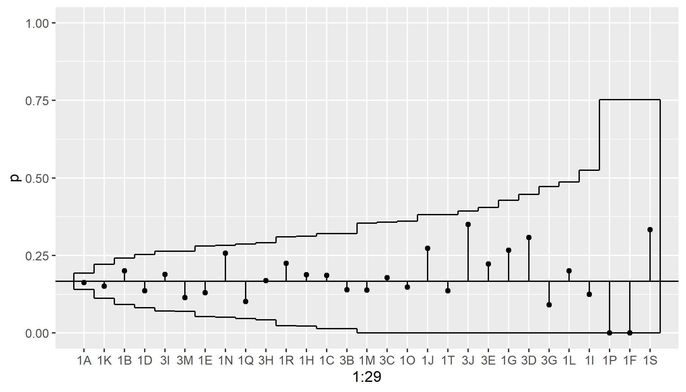

<div class="notes">

I won't show the actual calculations here, but they are tedious rather than difficult. Notice the the clinics with more births (the ones on the left) have narrower analysis of means limits than the clinics with fewer births (the ones on the right). But all the points are within the 

</div>

### Examining rates

```{r input-rates}
clinic <- LETTERS[1:5]
clinic <- 1:5
cat_scans <- c(50, 71, 41, 62, 89)
members <- c(26838, 26895, 26142, 25907, 26565) / 1000
rates <- data.frame(clinic, cat_scans, members)
rates
N <- sum(rates$cat_scans)
M <- sum(rates$members)
ubar <- round(N/M, 2)
rate_per_thousand <- round(cat_scans/members, 2)

lo <- round(
  ubar - 
    2.57 * sqrt(ubar) * 
      sqrt((M-members)/(M*members)), 2)
hi <- round(
  ubar + 
    2.57 * sqrt(ubar) * 
      sqrt((M-members)/(M*members)), 2)
```

There are `r N` CAT scans and `r format(M, big.mark=",")` thousand members across all clinics, providing an overall rate of `r ubar` scans per thousand patients.

<div class="notes">

One last example. This example is taken from page 46 of a book by Nelson, Wludyka, and Copeland. CAT scans are done at five different clinics. Each clinic serves a different number of members. 

</div>

### Plot of rates

```{r plot-of-rates}
rates %>%
  ggplot(aes(x=clinic, y=rate_per_thousand)) +
    geom_point() +
    expand_limits(x=c(0.5, 5.5)) +
    geom_hline(yintercept=ubar) + 
    geom_segment(x=clinic, y=ubar, xend=clinic, yend=rate_per_thousand) +
    geom_hline(yintercept=ubar) -> uchart1
ggsave("images/cat-01.png", plot=uchart1)
```

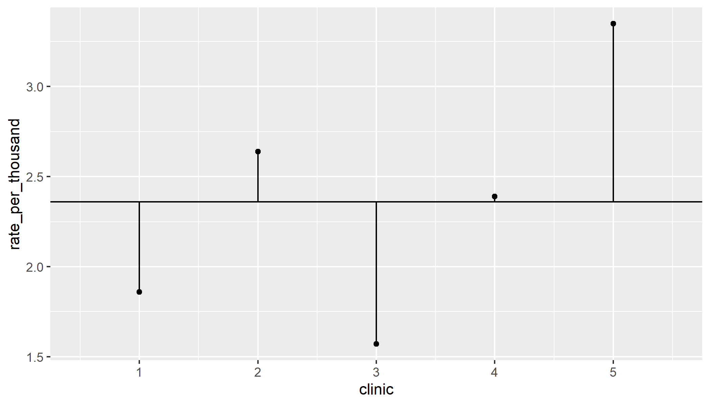

<div class="notes">

Here are the plots of CAT scan rates. Notice that clinics 1 and 3 have lower rates. Clinics 2 and 5 have higher rates.

</div>

### ANOM limits for Poisson rates

+ Limits
  + $\bar u \pm m(1-\alpha, k, \infty) \sqrt{\bar u}\sqrt{\frac{N-n_i}{Nn_i}}$
  + Note again that the limits change with i
  
+ Limits for first clinic
  + `r ubar` $\pm$ 2.57 $\sqrt{`r ubar`} \sqrt{\frac{`r M`-`r members[1]`}{(`r M`)(`r members[1]`)}}$
  + `r lo[1]` to `r hi[1]`
  + The rate is `r rate_per_thousand[1]`
  + This clinic's CAT scan rate is not differnt from the overall CAT scan rate.
  
<div class="notes">

Here are the formulas. Notice that where we formerly had the pooled standard deviation or the square root of p-bar time 1-pbar, now we have the square root of u-bar. This is because the variance of a Poisson random variable is equal to its mean. Thus the standard deviation of a Poisson random variable is equal to the square root of its mean.

The formulas here are very similar to control limits on a C-chart or a U-chart.

</div>

### Graphical display of ANOM limits

```{r uchart-graph}
uchart1 +
  geom_segment(x=clinic-0.5, y=lo, xend=clinic+0.5, yend=lo) +
  geom_segment(x=clinic-0.5, y=hi, xend=clinic+0.5, yend=hi) -> uchart2
ggsave("images/cat-02.png", plot=uchart2)
```

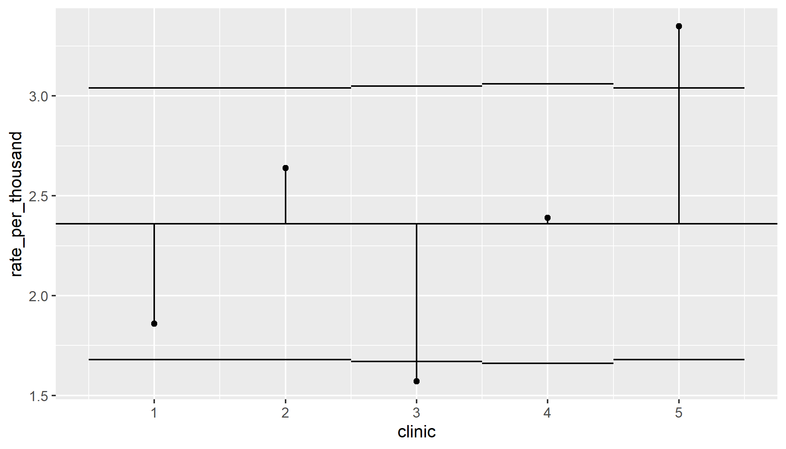

<div class="notes">

Here are the plots with analysis of means limits. The limits are slightly different because the clinics did not have the same number of members. But the differences in the limits are minor. Clinic 3 has a lower rate of CAT scan utilization compared to the overall rate and Clinic 5 has a higher rate of CAT scan utilization.

</div>

### Stop here if there are questions

+ What you've seen
  + Extensions to proportions and counts
+ What's coming up
  + Other extensions
  + How to interpret 
  + Contraindications


### Other extensions of ANOM

+ ANOM using ranks
+ Multifactor studies
+ Nonparametric approaches
+ Testing variances

<div class="notes">

If you look for applications of analysis of means in the peer reviewed literature and on the web, you'll see some advanced applications. I am not a big fan of these extensions, but perhaps that is just because I have not had a chance to work with them.

Donald Wheeler has developed the analysis of means methodology that uses ranges rather than variances to calculate the limits. This has some appeal to simplicity, as you can calculate a range a lot faster than you can calculate a standard deviation. There is some loss in efficiency, however, by using ranges.

Other applications look at multi-factor settings, and you can run analysis of means charts for main effects and interactions. Most example I have seen only have a small number of levels for each factor, and these examples don't seem to offer much beyond what traditional analysis of variance can already do. It may have more applications in searching for which combinations of factors lead to an interaction.

There are also several nonparametric approaches. Analysis of means does rely on an assumption of normality, but with small sample sizes and skewed data, this can sometimes be problematic.

Another extension is the use of analysis of means to look for groups that have much larger or much smaller variances. You could use this as a check on the homogeneity assumption for an upcoming analysis of variance, but there are already plenty of good tests out there. Further, there is controversy over how you should test for homogeneity or even if you should test for homogeneity. A better application might be examining a process where the mean level is not important, but it is important to have consistency around whatever mean you might have.

</div>

### How to handle results

+ Negative result implies consistency
  + But is it consistently bad?
  + Work on global changes
+ Positive result implies inconsistency
  + "If you can't be a good example, then you'll just have to be a horrible warning"
  + Work on local changes
+ Similar advice on control charts
  
<div class="notes">

The previous example showed a negative result. None of the C-section proportions was statistically significant. Every group was average.

Boring!

Well, maybe not. If the different medical groups had a similar mix of pregnancies and yet some had significantly higher probabilities for C-sections, then either the groups with the higher probabilities are doing something wrong, or everyone else is doing something wrong.

There is often too much inappropriate variation in the delivery of health care. A negative finding here says that this is not an issue with regard to C-section rates among the varying clinics.

What if you do see one or more statistically significant deviations from the overall average?

There's a well known quote from Catherine Aird, a famous English novelist. Think of the groups that are significantly above average (assuming that larger is better) as shining examples to be emulated. Study what is different about these groups that makes them perform so well. Can other groups learn from their experience.

Think of the groups that are significantly below average as the horrible warnings. Study what is different about these groups, so that you can improve them and/or so that you can avoid those problems in the other groups.

The point to both of these is that any future steps that you take should be local.

</div>

### ANOM contraindications

+ Simplicity comes with a price
+ You should not use ANOM 
  + when searching for the best group
  + when comparing to a control group
  + for a reward or punishment system  
  
<div class="notes">

You should avoid ANOM in certain settings.

It does not help when you want to identify the best among a group. There would be three or four groups that are all above average, but maybe they are all about the same or maybe one is head and shoulders above the others. Analysis of means cannot distinguish between these very different scenarios.

Pairwise comparisons work well when you are searching for the best. There is also a Bayesian approach that runs repeated simulations of the posterior distribution, ranks the estimated group means, and then estimates the proportion of times that a given group gets the number 1 rank in the simulation.

If there is a control group, your interest should be in deviations from the control group rather than deviations from an overall average. The Dunnett's post hoc comparison in an ANOVA model works well here.

Finally, and possibly the most important point is about rewards and punishments. There is an unfortunate tendency in many workplaces to blame all the quality problems on the workforce. In fact, it is the system that people work in that is most often deserving of blame.

If you use Analysis of Means (or any statistical approach, for that matter) to decide who gets bonuses and who gets fired, you're making a big mistake.

An unusual result for an individual or for a particular work group becomes the start of an investigation. Mindlessly offering rewards and punishments short-circuits the thinking process. I'm not saying that workers are never to blame. I just worry that statistics make it too easy to jump to conclusions.

</div>

### Conclusions

+ ANOM compares each group mean to the overall mean
  + It can be applied for proportions or counts as well
  + It has a simple interpretation 
  + It has a simple graphical display
  + Useful for some but not all research settings
+ Questions?