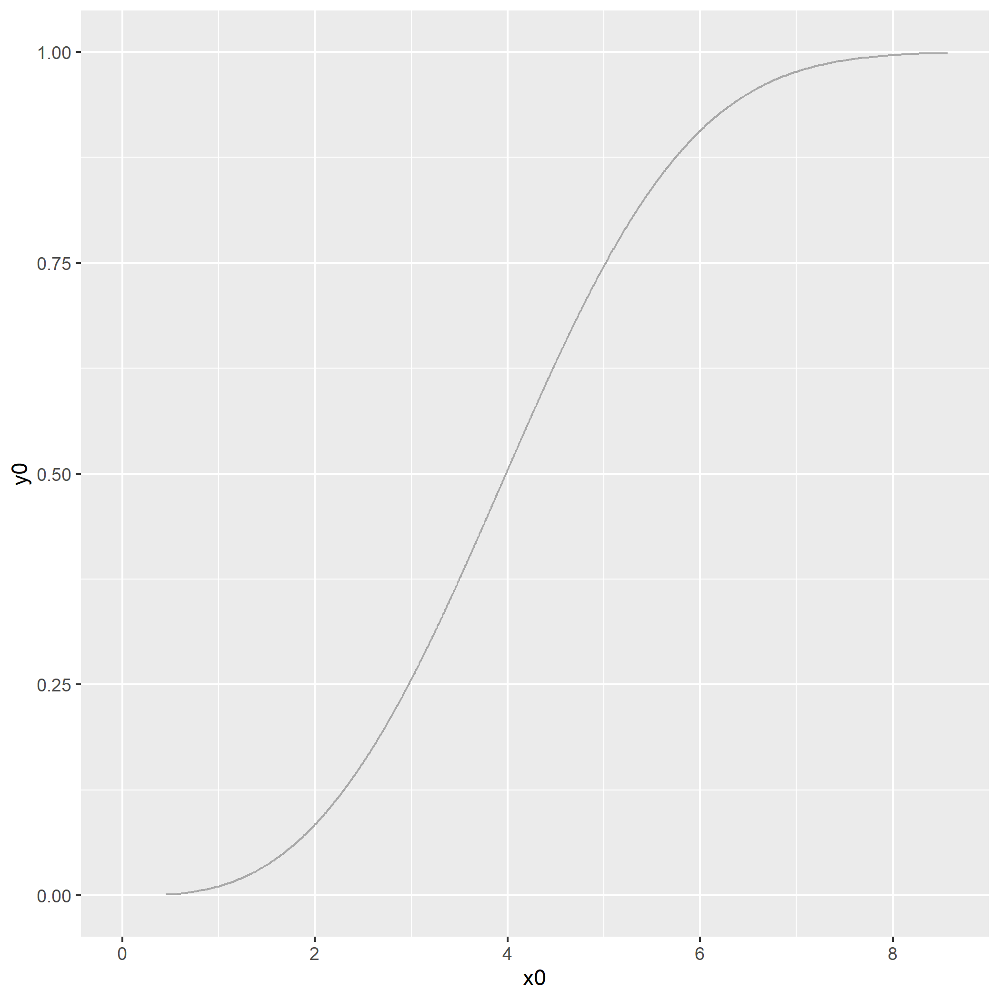
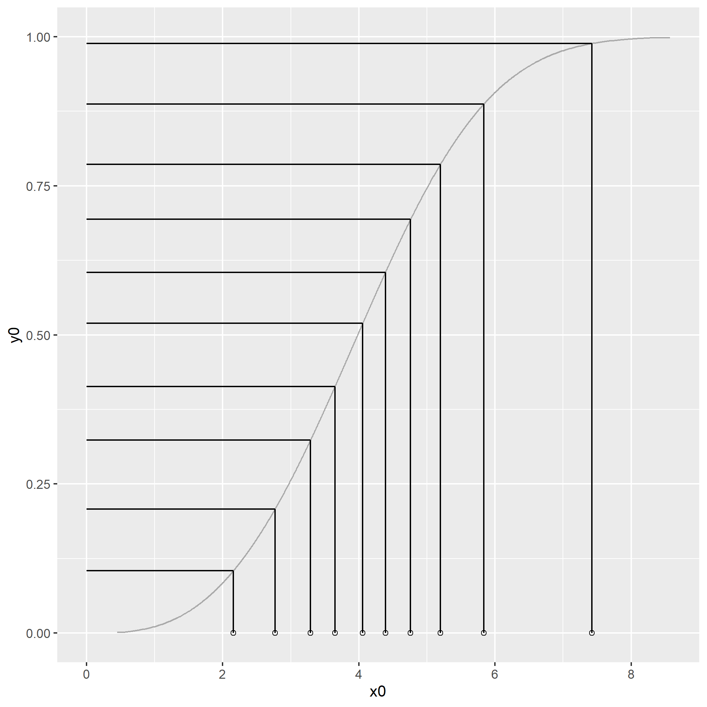
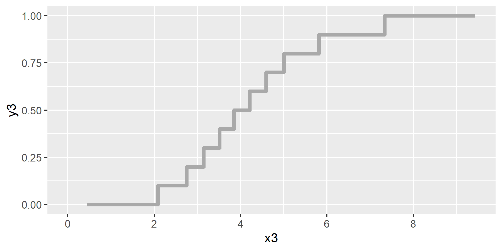
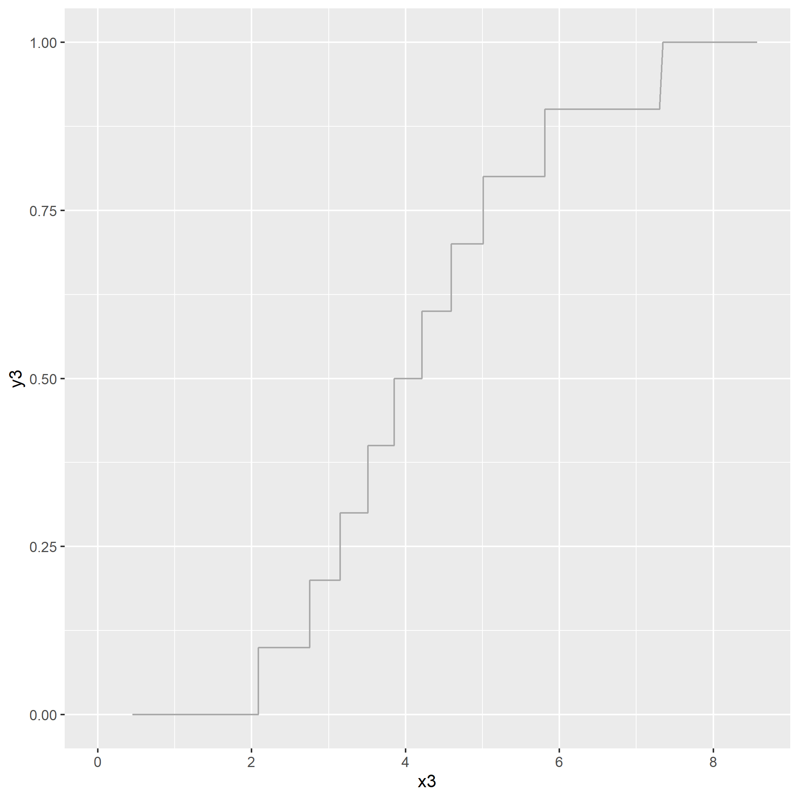
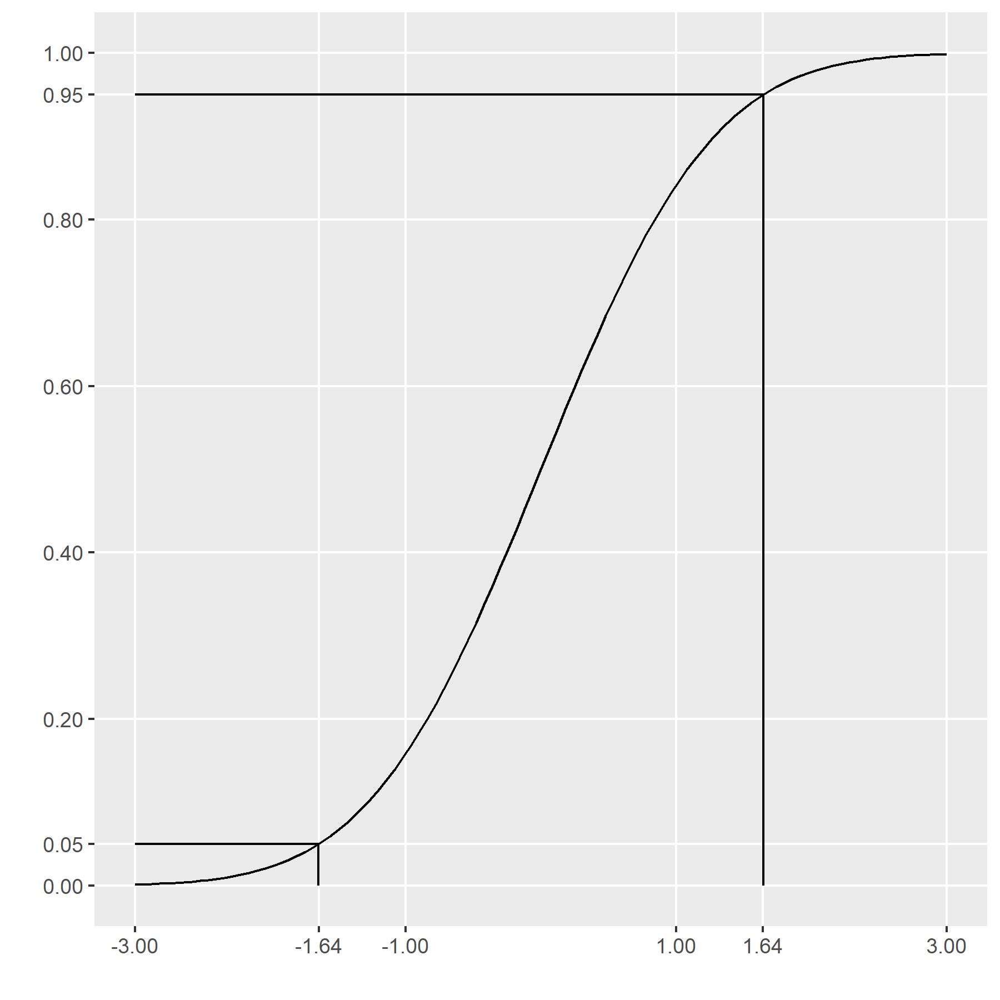
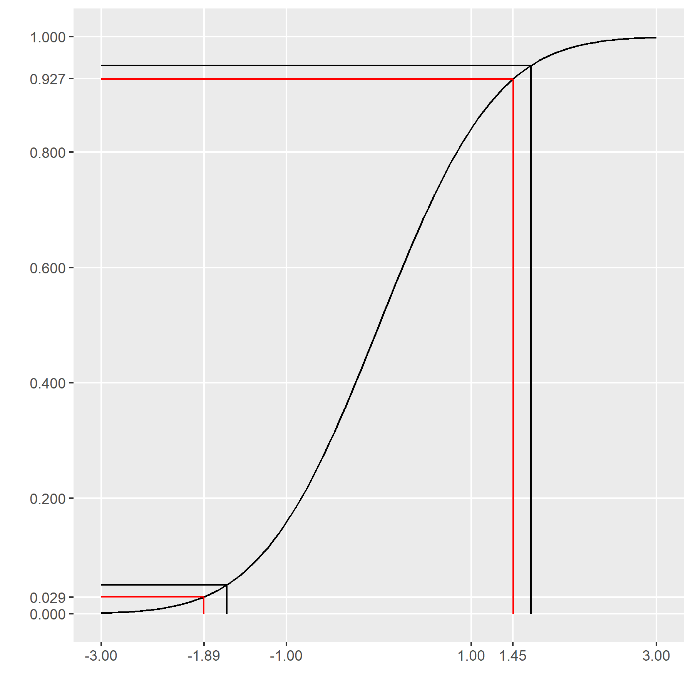
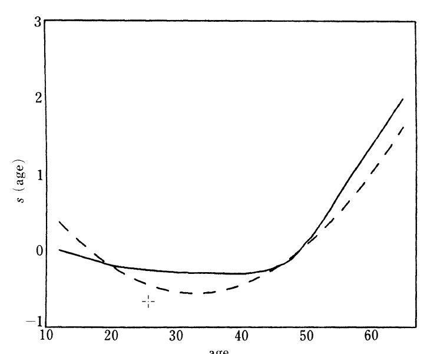
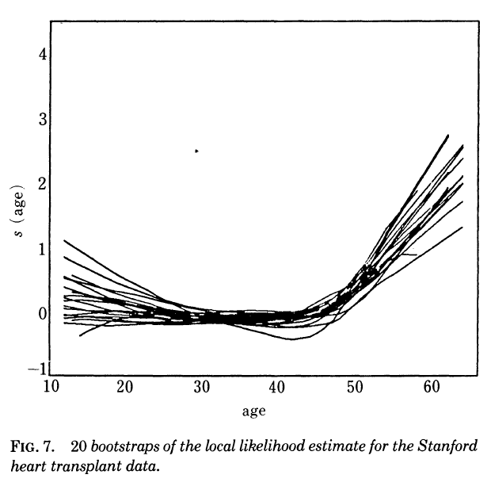

```{r setup, echo=FALSE}
knitr::opts_chunk$set(
  echo=FALSE,
  message=FALSE,
  warning=FALSE)
suppressMessages(
  suppressWarnings(
    library(tidyverse)
  )
)
# Width and height of all graphs
w=6
h=3
```

### Outline

+ History
+ Algorithms
+ Software
+ Special settings

<div class="notes">

Here is the abstract that I provided. I am including it here to remind myself what I promised to talk about.

The bootstrap is a methodology derived by Bradley Efron in the 1980s that provides a reasonable approximation to the sampling distribution of various "difficult" statistics. Difficult statistics are those where there is no mathematical theory to establish a distribution. It is also useful when you don't trust the mathematical theory because of a small sample size or potential violations of the underlying assumptions. The bootstrap is also a mechanism used by many machine learning algorithms to avoid overfitting. This talk will orient you to the general mechanisms of the bootstrap algorithm and illustrate its application in a couple of simple settings.

This talk will cover four major areas.

First, I will provide a historical overview, starting with a simpler method that the bootstrap was based on called the jackknife. Then I will talk about Bradley Efron's work to develop the bootstrap and establish its theoretical foundations. Then I will mention how bootstrapping has developed into a methodology used in machine learning called bagging.

I will illustrate the mechanics of the bootstrap: to estimate bias, calculate standard errors, compute confidence intervals, test hypotheses, and to visualize variations in statistical plots.

Then I will show some sample code on how to implement the bootstrap in SAS, Stata, and R.

Then I will discuss some special settings where you might consider more complex forms of bootstrapping.

</div>

### History of the bootstrap

+ Can you rely on asymptotic normality?
+ The jackknife
+ Bradley Efron's contributions
+ Recent application: bagging

<div class="notes">

I want to provide a bit of historical context. Before the bootstrap came along, researchers relied on a variety of mathematical theorems like the Central Limit Theorem and extensions to the Central Limit Theorem to estimate bias, calculate standard errors, produce confidence intervals, and test hypotheses.

The bootstrap represents an early attempt to use the power of computer simulation to estimate bias, calculate standard errors, produce confidence intervals, and test hypotheses. The bootstrap provides these answers in many settings where you can't find a version of the Central Limit Theorem that would apply or when you don't trust the approximation. I'll provide a brief overview of the jackknife, an earlier approach that the bootstrap was based on. Then I'll talk about Bradley Efron's work in the 1970's and 1980's to develop the bootstrap and to establish the mathematical principles that make the bootstrap work in so many different areas. Finally, I will talk about how bootstrapping came to be relied on in various machine learning algorithms.

</div>

### Can we rely on asymptotic normality? (1/4)


<div class="notes">

I need to start with a book that I used when I was in graduate school. The title is "Approximation Theorems in Mathematical Statistics" by Robert Serfling. It was all about the variety of ways to show that some statistic followed an asymptotic normal distribution.

</div>

### Can we rely on asymptotic normality? (2/4)

+ $\bar{X}=\frac{1}{n}\sum_{i=1}^{n} X_i$ is approximately normal if
  + The $X_i$ all come from the same distribution
  + The $X_i$ are all independent
  + The $X_i$ have a finite second moment

+ A more precise statement
  + $lim_{n \to \infty}\  \frac{\bar{X}-\mu}{\sigma \sqrt{n}} = N(0,1)$

<div class="notes">

I'm sure you're all familiar with the Central Limit Theorem. It's the granddaddy of all approximation theorems. It states that the average of independent identically distributed random variables is approximately normal.

The rule of thumb is that you can trust the normal approximation when the sample size is greater than 30. There is a lot that you can quibble about with respect to the cut-off of 30, but we're not going to get too fussy about this.

</div>

### Can we rely on asymptotic normality? (3/4)

Furthermore,

$E[\bar{X}]=\mu$

$\ $

$Var(\bar{X})=\frac{\sigma^2}{n}$

$\ $

$std.err(\bar{X})=\frac{\sigma}{\sqrt n}$

<div class="notes">

You can also show easily that the expected value of the sample mean is mu (the sample mean is an unbiased estimate of the population mean) and that the variance of the sample mean is the variance of an individual X value divided by the sample size n. Equivalently, the standard error of X-bar is the standard deviation of an individual value divided by the square root of the sample size.

</div>

### Can we rely on asymptotic normality? (4/4)

What about: 

$MAD(X)=\frac{1}{n}\sum_{i=1}^{n}|X_i-\bar{X}|$ 

$\ $

$IQR = X_{.75}-X_{.25}$

$\ $

$n < 30$

<div class="notes">

What about more complex settings?

What if you are measuring the mean absolute deviation (the average of the absolute values of each individual value minus the sample mean) or the interquartile range (the difference between the 75th percentile and the 25th percentile).

If you are really clever and if you understand all the approximation theorems in Robert Serfling's book, you will know how to establish an approximation to these statistics (usually a normal approximation, but sometimes there are other distributions like the chi-square distribution that represent a good approximation).

But there are lots of settings where even Dr. Serfling's hard work will still leave you high and dry. Some statistics are just so messy that no one can figure out an asymptotic approximation.

But an even more fundamental question is what do you do when the sample size is not large enough to justify the use of the Central Limit Theorem? I put down n<30 here, but in some settings (well behaved distributions without much skewness and only a weak tendency to produce outliers), you might get by with only 10 observations. Other times (extremely skewed distributions and/or a strong tendency to produce outliers), even a sample size of 300 is inadequate to assume an approximately normal distribution.

It turns out that you can use simulations involving the data itself to establish an underlying distribution.

You might find, after applying the bootstrap, that the normal distribution is a reasonable approximation. If so, great! Consider the bootstrap to be a sensitivity check that you passed with flying colors. 

If the results of the bootstrap are markedly different from the results assuming approximate normality, then investigate further. But you can almost always rely on the bootstrap results to provide valid confidence intervals and hypothesis tests. Although there are a few settings where you shouldn't rely on a bootstrap approach, it is a credible approach for a surprisingly broad range of settings.

</div>

### The jackknife (1/4)


<div class="notes">

To understand the bootstrap, you need to understand the approach that it was intended to improve upon, the jackknife.

The jackknife was first developed in 1949 by Maurice Quenouille and was extended to a more general setting by John Tukey in the 1950s. Dr. Tukey was fond of giving clever names to various statistical terms. He was the one, for example, who coined the term "bit" as a shorted form of binary digit. He chose the name "jackknife" for the Quenouille approach because the jackknife is an all-purpose tool.

</div>

### The jackknife (2/4)

$X\ \ \ \ \ \  = (2,3,7,5,6)$

$\ $

$X^{(-1)} = (\ \ ,3,7,5,6)$

$X^{(-2)} = (2,\ \ ,7,5,6)$

$X^{(-3)} = (2,3,\ \ ,5,6)$

$X^{(-4)} = (2,3,7,\ \ ,6)$

$X^{(-5)} = (2,3,7,5,\ \ \ )$

<div class="notes">

For the jackknife, you create subsamples by leaving one data point out.

The original data set in this small artificial example is 2, 3, 7, 5, 6. The first subsample leaves out the 2. The second subsample leaves out the 3. And so forth.  With five data points, you have five subsamples.

</div>

### The jackknife (3/4)

```{r}
mad <- function(u) {mean(abs(u-mean(u)))}

x <- c(2,3,7,5,6)
m0 <- mad(x)
m1 <- mad(x[-1])
m2 <- mad(x[-2])
m3 <- mad(x[-3])
m4 <- mad(x[-4])
m5 <- mad(x[-5])
mn <- mean(c(m1, m2, m3, m4, m5))
sn <- sd(c(m1, m2, m3, m4, m5))
```

$MAD$ (`r paste(x, sep=",")`) = `r m0`

$\ $

$MAD$ (`r paste(x[-1], sep=",")`) = `r m1` 

$MAD$ (`r paste(x[-2], sep=",")`) = `r m2` 

$MAD$ (`r paste(x[-3], sep=",")`) = `r m3` 

$MAD$ (`r paste(x[-4], sep=",")`) = `r m4` 

$MAD$ (`r paste(x[-5], sep=",")`) = `r m5` 

<div class="notes">

Then calculate a statistic (in this case, the mean absolute deviation). Do it first for the entire sample. Then do it for each jackknife subsample. Notice that there is some variation in the results from one jackknife subsample to another.

</div>

### The jackknife (4/4)

+ MAD (Full sample) = `r m0`
+ Average MAD (Jackknife subsamples) = `r mn`
+ Standard deviation MAD (Jackknife subsamples) = `r round(sn, 3)`

<div class="notes">

The average of the jackknife subsamples is a bit less than 1.68. This indicates a small amount of bias, though I would argue that the size of the bias is manageable. The standard deviation of the jackknife subsamples is around 0.3 (I'm rounding liberally here). This standard deviation is a reasonable estimate for the standard error of the mean absolute deviation. So plus or minus two standard errors gives you an approximate confidence interval from 1.0 to 2.2. A fair amount of imprecision, but hardly surprising for a dataset with a total sample size of 5. 

</div>

### Bradley Efron's contribution (1/5)


<div class="notes">

This image is from a White House ceremony where Bradley Efron received the President's National Medal of Science. I was quite shocked when I found this picture a few days ago, and I've been trying to call Joe Biden ever since to see where my medal is. Seriously, you have to be a really special statistician to deserve an honor like this.

Most of the information about Bradley Efron comes from

Denise LaFontaine. The History of Bootstrapping: Tracing the Development of Resampling With Replacement. The Mathematics Enthusiast 2021, 18(1). Available in [pdf format][laf1].

[laf1]: https://scholarworks.umt.edu/cgi/viewcontent.cgi?article=1515&context=tme

Bradley Efron entered the PhD program in Statistics at Stanford University in 1960. He was influenced by one of the faculty at Stanford, Rupert Miller, who was working on establishing conditions under which the jackknife did or did not perform well. Shortly after graduating, Dr. Efron started working on an approach that would fix some of the shortcomings of the jackknife.

It turns out that the jackknife works in a variety of settings, but fails badly for certain statistics like the median and the interquartile range. The bootstrap handles all the cases that the jackknife handles but also handles quite a few that the jackknife can't.

</div>

### Bradley Efron's contribution (2/5)

The bootstrap sample=sampling with replacement.

```{r}
set.seed(1245)
b1 <- matrix(sample(x, 2500, replace=TRUE), nrow=500)
m <- apply(b1, 1, mad)
mn <- mean(m)
sn <- sd(m)
```

The original data: (`r paste(x, collapse=", ")`)

Bootstrap sample #1: (`r paste(b1[1, ], sep=",")`)

Bootstrap sample #2: (`r paste(b1[2, ], sep=",")`)

Bootstrap sample #3: (`r paste(b1[3, ], sep=",")`)

...

Bootstrap sample #500: (`r paste(b1[500, ], sep=",")`)

<div class="notes">

Bradley Efron decided to create subsamples by sampling from the full data set, but with replacement.

Sampling with replacement means that the first data value selected gets tossed back into the pool and is available for selection later on. It might get selected a second, or even a third time. A consequence of this is that one or more of the original values might not make it into the bootstrap sample. If one data value is hogging two or three spots, that squeezes out room for another data value.


The first bootstrap sample picks the 5 twice and skips over the 6. The second bootstrap sample picks the 5 twice and the 7 twice and skips over the 2 and the 6.

One big advantage of the bootstrap samples is that you can do this hundreds or even thousands of times.

</div>

### Bradley Efron's contribution (3/5)

MAD(`r paste(b1[1, ], sep=",")`) = `r m[1]`

MAD(`r paste(b1[2, ], sep=",")`) = `r m[2]`

MAD(`r paste(b1[3, ], sep=",")`) = `r m[3]`

...

MAD(`r paste(b1[500, ], sep=",")`) = `r m[500]`

<div class="notes">

Here's what you might do with the bootstrap samples. Suppose we are interested in the behavior of the mean absolute deviation for this particular dataset. You can calculate that statistic for each bootstrap sample. It is 1.52 for the first bootstrap sample, 1.28 for the second bootstrap sample, and so forth. Notice how much this statistic varies from one sample to the next.

</div>

### Bradley Efron's contribution (4/5)

+ MAD (Full sample) = `r m0`
+ Average MAD (Bootstrap samples) = `r round(mn, 3)`
+ Standard deviation MAD (Bootstrap samples) = `r round(sd(m), 3)`

<div class="notes">

The average across all the bootstrap samples is a bit smaller than the estimate for the original data. This indicates, as we noticed before with the jackknife, a small amount of bias.

The standard deviation from the bootstrap mean absolute deviations is an estimate of the standard error of that statistic. It is fairly large, but as noted earlier, not too much of a surprise.

</div>

### Bradley Efron's contribution (5/5)

```{r}
g1 <- ggplot(data.frame(m=m), aes(x=m)) + 
  geom_histogram(binwidth=0.1)
ggsave("../images/histogram01.png", g1, width=w, height=h, units = "in")
```


<div class="notes">

This is a histogram of the 500 bootstrapped estimates of the mean absolute deviation. Notice that it is "patchy" and does not follow a smooth bell shaped curve. This is an important issue that we will address when computing confidence intervals.

</div>

### A bit of intuition about the bootstrap (1/4)

```{r}
# Generate cumulative distribution function (CDF)
lambda <- 4.5
k <- 3

finv <- function(u) {
  lambda*(-log(1-u))^(1/k)
}

y0 <- seq(0.001, 0.9999, length=9999)
x0 <- finv(y0)
```

```{r}
# Generate repeatable sequence of uniform random variables
set.seed(1245)
u1 <- runif(10)
```

```{r}
# Generate random values from the CDF
y1 <- sort(runif(10))

# a cheat to make the uniforms behave better
# y1 <- (rep(1:10) + 2*y1)/12

x1 <- finv(y1)
```

```{r}
# Generate second set of values from the CDF
y2 <- sort(runif(10))

# a cheat to make the uniforms behave better
y2 <- ((1:10) + 2*y2)/12

x2 <- finv(y2)
```

```{r}
# Generate empirical CDF
x3 <- x0
y3 <- rep(0, length(y0))
for (i in 1:10) {
  y3 <- y3 + (x3 >= x2[i])/10
}
```

```{r}
### Generate bootstrap sample
y4 <- y1
x4 <- x2[ceiling(10*y4)]

data.frame(x4) %>%
  group_by(x4) %>%
  mutate(n4=row_number(x4)) %>%
  ungroup %>%
  pull(n4) -> n4
n4 <- (n4-1)/70
```

```{r}
# Plot CDF
data.frame(x0, y0) %>%
  ggplot(aes(x0, y0)) +
    geom_line(col="darkgray", size=1.5) +
    scale_x_continuous(breaks=2*(0:4)) +
    expand_limits(x=0) -> intuition0
ggsave("../images/intuition0.png", intuition0, width=w, height=h, unit="in")
```



<div class="notes">

Suppose we have inside knowledge about the true probabilities for the data in our sample. Here is a cumulative distribution function that can generate data for a particular distribution.

The cumulative distribution allows you to compute the cumulative probability for any data value. Select the data value on the X axis, project up to the curve and slide horizontally to read the cumulative probability on the Y axis.

You can also invert the process to get a percentile. Select a percentile level on the Y-axis, project horizontally until you intersect the curve, then drop down to the X-axis to get the percentile. 

To get the median, for example, find 0.5 on the y-axis, project over to the curve and down to about 4.

It's subtle, but notice that the curve is a just a bit lopsided, indicating a tiny amount of a skewness in this data.

If you had inside knowledge, enough to specify the cumulative distribution function, you could generate random samples from this distribution and calculate statistics on those random samples. It is a basic tool in Statistics known as Monte Carlo simulation.

</div>

### A bit of intuition about the bootstrap (2/4)

```{r}
# Add uniforms to CDF graph
intuition1 <- intuition0
for (i in 1:10) {
  intuition1 +
    geom_segment(
      x=0, 
      y=y1[i], 
      xend=x1[i], 
      yend=y1[i]) +
    geom_segment(
      x=x1[i],
      y=y1[i],
      xend=x1[i],
      yend=0)  +
    geom_point(
      x=x1[i], 
      y=0, 
      shape=1) -> intuition1
}
ggsave("../images/intuition1.png", intuition1, width=w, height=h, units = "in")
```



<div class="notes">

The simplest way to generate random variables from a specific cumulative density function is to select values on the y-axis from a random variable uniformly distributed on the interval 0 to 1. Project those values horizontally until they intersect the curve and then drop down to the X-axis. What you're doing is picking random percentiles from the distribution.

So grab n uniform random variables, convert them into percentiles from the cumulative distribution function, and then calculate some statistic like the mean absolute deviation. Get another set of n uniform random variables and repeat the process. With computers as fast as they are today, you could do this a few hundred or even a few thousand times and not break a sweat.

Of course, most of the time, you can't run this Monte Carlo simulation without making some strong assumptions. If you have a particular set of data, do you ever really know what the cumulative distribution function is that created this data? Even if you were lucky enough to have some inside information--that it was associated with a normal random variable, for example--you wouldn't know which normal. You wouldn't know the mu and you wouldn't know the sigma.

</div>

### A bit of intuition about the bootstrap (3/4)

```{r}
data.frame(x3, y3) %>%
  ggplot(aes(x3, y3))  +
    geom_line(col="darkgray", size=1.5) +
    scale_x_continuous(breaks=2*(0:4)) +
    expand_limits(x=0) -> intuition3
ggsave("../images/intuition3.png", intuition3, width=w, height=h, units = "in")
```



<div class="notes">

You can get a good approximation to the cumulative distribution function using the data. Draw a step function with a jump of 1/n at each data point where n is the number of data points.

This step function is known as the empirical cumulative distribution function.

The empirical cumulative distribution function does a pretty good job. It is unbiased and converges to the true cumulative distribution function as the sample size increases.

</div>

### A bit of intuition about the bootstrap (4/4)

```{r}
boot_data <- data.frame(x4=x4, y4=y4, n4=n4)
intuition3 +
    geom_segment(
      data=boot_data,
      aes(x=x4, y=y4),
      x=x4,
      y=y4,
      xend=x4,
      yend=0)  +
    geom_segment(
      data=boot_data,
      x=0, 
      y=y4, 
      xend=x4, 
      yend=y4) +
    geom_point(
      data=boot_data,
      x=x4, 
      y=n4, 
      shape=1) -> intuition4
ggsave("../images/intuition4.png", intuition4, width=w, height=h, units = "in")
```



<div class="notes">

If you can't generate random variables from the true cumulative distribution function, then a good approximation would be to generate random variables from the empirical cumulative distribution function. Generate values on the Y-axis that are uniformly distributed on the interval 0 to 1, project over horizontally and then drop down to the X-axis.

What you're doing here is sampling from the data with replacement. So, at least intuitively, this is equivalent to an approximate Monte Carlo simulation based on the empirical cumulative distribution function.

Notice in this example that some of the data values appear two or more times and others are not selected at all. Because it is done randomly, you get a reasonable set of simulated values, even without knowing the true underlying cumulative distribution function. 

</div>

### Meaning of the term "bootstrap"


<div class="notes">

The name bootstrap comes from the saying "Lift yourself up by your bootstraps". It is a reference to getting something done without any help. This is analogous to the statistical bootstrap. It produces results with just the data at hand and no outside help from an assumed distribution.

But the image of lifting yourself into the air by yanking on a loop of your shoe is also an analogy to doing something that seems impossible. The Useless Etymology website has a [nice discussion][use1] of this saying, and the image you see here is taken from their website. 

The origin of this phrase "Lift yourself up by your bootstraps" is unclear. Several web pages trace this phrase back to a book, The Surprising Adventures of Baron Munchausen. This was a litany of tall tales somewhat akin to the Paul Bunyan character in American folklore. One of the improbable tasks that Baron Munchausen did was lifting himself out of a deep well by pulling on his bootstraps.

[use1]: https://uselessetymology.com/2019/11/07/the-origins-of-the-phrase-pull-yourself-up-by-your-bootstraps/

</div>

### Bagging (1/4)

+ Portmanteau for bootstrap aggregation
  + Used in random forests
+ Developed by Leo Breiman in 1996
+ Start with CART model
  + Classification And Regression Tree

<div class="notes">

I want to briefly address bagging, an important application of the bootstrap to machine learning. Bagging is a portmanteau, a combination and shortening of two words: bootstrap aggregation.

The basic building block for bagging in the random forest model is the CART model. CART is an acronym for Classification and Regression Trees.

</div>

### Bagging (2/4)


<div class="notes">

A regression tree is a model used for continuous outcomes. It finds optimal splits of the data that create subgroups where the outcome variable shows very little variation. This is an example from the Statology blog on how to fit CART models.

Zach Bobbitt. How to Fit Classification and Regression Trees in R. Statology blog, 2020-11-22. Available in [html format][bobb1].

[bobb1]: https://www.statology.org/classification-and-regression-trees-in-r/

The graph shows a prediction model for baseball player salaries. If the numbers seem low, it is because the data comes form 1987. The first split is between years in the league. If it is less than 4.5, the node to the left shows a mean salary of 225.83 thousand dollars. If it is greater than 4.5, the node to the right shows an additional split: were the number of home runs less than 16.5, then another split is the number of home runs also less than 8.5 then the mean salary is 502.81 thousand dollars. I won't go through every branch, but each of the final nodes is a combination of splits involving years in the league or home runs.

</div>

### Bagging (3/4)


<div class="notes">

This is an example of a classification tree. You use a classification tree when you are predicting a binary outcome.

This is an example from the [Wikipedia page on decision tree learning][wik1]. It is work by Gilgoldm and published under a Creative Commons open source license (CC BY-SA 4.0) and is available for download [here][wik2].

[wik1]: https://en.wikipedia.org/wiki/Decision_tree_learning
[wik2]: https://commons.wikimedia.org/w/index.php?curid=90405437

This classification tree creates splits that lead to probabilities that are homogenous (close to either 0 or 1). This tree looks at survival of passengers on the Titanic. The Titanic was a massive passenger ship, especially massive for its time. It was so big that it was considered unsinkable. It first sailed across the Atlantic in 1912, hit an iceberg, and sank like a stone. Many of the passengers died, but the deaths were not distributed evenly across all demographic groups.

The classification tree for survival first splits by gender. For females, you can't improve things too much by splitting further. This group has a 0.73 survival probability and it represents 36% of the total data. For males, you can improve the homogeneity of the outcome by looking at age and the number of siblings. For males, being young (under 9.5 years of age) and not being part of a big family (two or fewer siblings) leads to a suvival probability of 0.89. But this is a small subset of the passengers, only 2% of the total.

Both classification trees and regression trees have a tendency to overfit the data. They are also highly sensitive to small changes in the data. In fact, I would have a hard time recommending the use of these models at all.

There is an approach, however, that largely overcomes these concerns. It is called an ensemble approach. You combine multiple regression or classification trees into a "forest." And you do this with the help of the bootstrap.

</div>

### Bagging (4/4)

Bootstrap sample b=1: CART model predictions, $\hat{Y}_{(1)}$

Bootstrap sample b=2: CART model predictions, $\hat{Y}_{(2)}$

Bootstrap sample b=3: CART model predictions, $\hat{Y}_{(3)}$

...

Bootstrap sample b=B: CART model predictions, $\hat{Y}_{(B)}$

Final prediction: $\frac{1}{B}\sum_{b=1}^B \ \hat{Y}_b$


<div class="notes">

In bagging, you fit a model (in the case of Random Forests, you fit a CART model) to a few hundred or thousand bootstrap samples. Get predicted values for each model. Average those predicted values across all the bootstrap samples.

There are some additional enhancements to the Random Forest models, but the key element is the bagging step.

Note: Each bootstrap sample might produce a different set of independent variables, so you can't say anything directly about which variables help the most in predicting the outcome. You can't get p-values or confidence intervals for individual independent variables. There are some indirect ways to assess this, but I will not talk about these.

</div>

### Break #1

+ What have you learned
  + History of the bootstrap
+ What's coming next
  + Algorithms
  
### Algorithms

+ Estimate bias
+ Calculate standard errors
+ Compute confidence intervals
+ Test hypotheses
+ Visualizations
+ How many bootstraps

<div class="notes">

I want to show the algorithms used in bootstrapping. These fall into five categories: estimating bias, calculating standard errors, computing confidence intervals, testing hypotheses, and visualization. I also want to provide some guidance on how many bootstrap samples you need.

</div>

### Evaluate estimates on bootstrapped samples

+ $\hat\theta=\hat\theta(X_1, X_2,..., X_n)$ is an estimate of $\theta$.
+ Recalculate for B bootstrap samples
  + $\hat\theta^{(1)}=\hat\theta(X^(1)_1,X^(1)_2,...,X^(1)_n)$
  + $\hat\theta^{(2)}=\hat\theta(X^(2)_1,X^(2)_2,...,X^(2)_n)$
  + ...
  + $\hat\theta^{(B)}=\hat\theta(X^(B)_1,X^(B)_2,...,X^(B)_n)$

<div class="notes">

For all of the proposed uses of the bootstrap, you start with an estimate based on the full dataset. Call that estimate theta-hat.

Then for each bootstrap sample, you calculate the same estimate. Call these theta-hat superscript 1, theta-hat superscript 2, all the way through to theta-hat superscript B, where B is the number of bootstrap samples.

</div>

### Estimate bias

+ Compare the bootstrap average to the original estimate
  + $\bar\theta-\hat\theta$
  + where $\bar\theta=\frac{1}{B}\sum_{b=1}^{B}\hat\theta^{(b)}$
  
<div class="notes">

To estimate bias, see how much the average of the bootstrapped estimates differs from the estimate based on the full sample.

For what it's worth, many people (including myself) consider concerns about bias to be overblown. There are times when a biased estimate can be quite serious, especially if the bias is caused by a flaw in the sampling process. But debates about whether you should divide n versus n-1 in the formula for variance are a bit silly. 

Furthermore, a small amount of bias in an estimator may be worth it if you can get less sampling error in return.

There's no correct answer about if and when you should adjust for bias, but I am presenting it here as a simple application of the bootstrap. In all candor, the use of the bootstrap for calculating standard errors, computing confidence intervals, and testing hypotheses are far more common uses of the bootstrap.

</div>

### Calculate standard errors

+ Calculate the standard deviation of the bootstrap estimates
  + $\sigma^{(B)}=\sqrt{\frac{1}{B-1}\sum_{b=1}^{B}(\hat\theta^{(b)}-\bar\theta)^2}$

<div class="notes">

You can use the standard deviation of the bootstrapped estimates as an estimate of the standard error of your statistic.

We'll talk next about confidence intervals and hypothesis tests. But the question arises: why would you want a bootstrap estimate of the standard error if not to use it in a confidence interval or a hypothesis test? 

Perhaps there is some value in getting the standard error using a classic approach and comparing it to the bootstrap estimate of the standard error. If the two are close, that gives you some reassurance that the classic approach is appropriate. If they differ, then examine things like whether the sample size is large enough to justify the normal approximation or if one of the assumptions that you need is questionable.

</div>
  
### Compute confidence intervals

+ Use bootstrap standard error
+ Use percentiles from the bootstrap distribution
+ Use bias corrected and adjusted percentiles

<div class="notes">

The most frequent use of the bootstrap, by far, is the creation of confidence intervals. There are many ways to do this, but three of the most common approaches are a classical interval using the bootstrap standard error, an interval that relies on percentiles from the bootstrap distribution, and some corrections that improve the accuracy of percentile confidence interval.

</div>

### Compute confidence intervals, bootstrap standard error

+ Easy, once you have a standard error
  + $\hat\theta^{(b)} \pm z_{1-\alpha/2}\sigma^{(B)}$
+ Should you use a t-distribution?
  + Uncertain degrees of freedom

<div class="notes">

Once you have a standard error, the simplest confidence interval is going use the bootstrap estimate plus or minus a percentile from the standard normal distribution times the bootstrap standard deviation.

There is some controversy about whether you should use a t distribution here. I personally do not recommend it, because it is unclear what the degrees of freedom should be.

Other approaches may be preferred. The classic interval makes a pretty strong assumption. It assumes that the sampling distribution of the estimate is symmetric. Even so, the classical approach is still reasonable.

</div>

### Compute confidence intervals, percentiles

+ Take percentiles directly from the bootstrap sample
  + Example, B=1000
     + Select the 25th and 975 observations in sorted order
     
<div class="notes">

An even simpler approach is to take percentiles directly from the bootstrap sample. For this, you need a pretty large number of bootstrap samples. Although some sources say that a few hundred might be okay, I would recommend at least a thousand.

With a thousand bootstrap samples, you would select the 25th and 975th observations, after sorting the data.

</div>

### Compute confidence intervals, BCa (1/5)

+ Bias adjustment (using bootstrap estimates)
  + $\hat z_0=\Phi^{-1}(\frac{1}{B}(H(\hat\theta-\hat\theta^{(b)}))$ where
    + H(x)=1 for $x \geq 0$, 0 for $x < 0$.
    + $\Phi^{-1}$ is the percentile function for the standard normal distribution

+ Acceleration (using jackknife)
  + $\hat a = \frac{\sum_{i=1}^n(\hat\theta_{(.)}-\hat\theta_{(i)})^3}{6(\sum_{i=1}^n (\hat\theta_{(.)}-\hat\theta_{(i)})^2)^{3/2}}$

<div class="notes">

You can improve on the percentile confidence interval, but the work is tricky.

So tricky that every reference that I reviewed showed these equations and immediately apologized for their complexity. There appears to be little intuition that you can discern from these formulas. The formula for z-hat-0 is a bit easier to follow, perhaps. It is an adjustment for bias.

The H function effectively counts the number of bootstrap estimates that are less than the estimate based on the original data. Divide by the number of bootstrap samples to get a proportion. Phi inverse converts this proportion into a percentile from a standard normal distribution. If exactly half of the bootstrap estimates are greater than the estimate based on the original data, then you get a big fat zero which means no bias adjustment.

The formula for a-hat is a bit harder to follow. Notice that it involves deviations from the mean raised to the third power, which seems to be akin to a measure of skewness.

Dr. Efron refers to it as an acceleration, because it relates to the second derivative of the score function.

Remember that in Calculus, the first derivative is analogous to speed and the second derivative is analogous to acceleration.

Don't ask me what the score function represents. Also don't ask me why the acceleration relies on a jackknife sample rather than a bootstrap sample. 

If z-hat-sub-0 is equal to zero, there is no adjustment to the confidence interval based on bias.

If the jackknife estimates are perfectly symmetric, then a-hat is a big fat zero, meaning no adjustment to the confidence interval based on skewness.

</div>

### Compute confidence intervals, BCa (2/5)

+ Replace $\alpha/2$ with
  + $\Phi^{-1}(\hat z_0+\frac{\hat z_0+z_{\alpha/2}}{1-\hat a(\hat z_0+z_{\alpha/2})})$
+ Replace $1-\alpha/2$ with
  + $\Phi^{-1}(\hat z_0+\frac{\hat z_0+z_{1-\alpha/2}}{1-\hat a(\hat z_0+z_{1-\alpha/2})})$

<div class="notes">

The percentiles that you select from the bootstrap distribution are no longer at alpha/2 and 1-alpha/2, but are moved to account for bias and skewness in the bootstrap distribution.

</div>

### Percentiles with no adjustment (3/5)

```{r}
x <- seq(-3, 3, length=101)
y1 <- pnorm(x)
alpha <- 0.10
a1 <-   alpha/2
a2 <- 1-alpha/2
z1 <- qnorm(  alpha/2)
z2 <- qnorm(1-alpha/2)
data.frame(x, y1) %>%
  ggplot(aes(x, y1)) +
    geom_line() +
    geom_segment(x=z1, y= 0, xend=z1, yend=a1) +
    geom_segment(x=z1, y=a1, xend=-3, yend=a1) +
    geom_segment(x=z2, y= 0, xend=z2, yend=a2) +
    geom_segment(x=z2, y=a2, xend=-3, yend=a2) -> g0
  g0 +
    scale_x_continuous(
      name=" ",
      breaks=c(round(c(z1, z2), 2), -3, -1, 1, 3), 
      minor_breaks=NULL) +
    scale_y_continuous(
      name=" ",
      breaks=c(round(c(a1, a2), 3), (0:5)/5),
      minor_breaks=NULL) -> bca01
ggsave("../images/bca01.png", bca01, width=w, height=h, units = "in")
```



<div class="notes">

Here's a picture showing what the unadjusted percentiles look like for a 90% confidence interval. Z-0-hat is zero, so no bias adjustment and a-hat is also zero, so no adjustment for skewness. You would just choose the 5th and 95th percentiles of the bootstrapped estimates.

</div>

### Percentiles with bias adjustment (4/5)

```{r}
z0 <- -0.1
z1 <- qnorm(  alpha/2)+2*z0
z2 <- qnorm(1-alpha/2)+2*z0
a1 <- pnorm(z1)
a2 <- pnorm(z2)
g0 + 
    geom_segment(x=z1, y= 0, xend=z1, yend=a1, color="red") +
    geom_segment(x=z1, y=a1, xend=-3, yend=a1, color="red") +
    geom_segment(x=z2, y= 0, xend=z2, yend=a2, color="red") +
    geom_segment(x=z2, y=a2, xend=-3, yend=a2, color="red") +
    scale_x_continuous(
      name=" ",
      breaks=c(round(c(z1, z2), 2), -3, -1, 1, 3), 
      minor_breaks=NULL) +
    scale_y_continuous(
      name=" ",
      breaks=c(round(c(a1, a2), 3), (0:5)/5),
      minor_breaks=NULL) -> bca02
ggsave("../images/bca02.png", bca02, width=w, height=h, units = "in")
```


<div class="notes">

A bias adjustments shifts the z values to the left or the right. In this hypothetical case, the z values are shifted left by 0.2 units, and instead of using the instead of the 5th and the 95th percentiles, you would use would be the 3.3 percentile and the 92.6 percentile.

</div>

### Percentiles with acceleration adjustment (5/5)

```{r}
a_hat <- -0.08
z1 <- qnorm(  alpha/2)/(1-a_hat*qnorm(  alpha/2))
z2 <- qnorm(1-alpha/2)/(1-a_hat*qnorm(1-alpha/2))
a1 <- pnorm(z1)
a2 <- pnorm(z2)
g0 + 
    geom_segment(x=z1, y= 0, xend=z1, yend=a1, color="red") +
    geom_segment(x=z1, y=a1, xend=-3, yend=a1, color="red") +
    geom_segment(x=z2, y= 0, xend=z2, yend=a2, color="red") +
    geom_segment(x=z2, y=a2, xend=-3, yend=a2, color="red") +
    scale_x_continuous(
      name=" ",
      breaks=c(round(c(z1, z2), 2), -3, -1, 1, 3), 
      minor_breaks=NULL) +
    scale_y_continuous(
      name=" ",
      breaks=c(round(c(a1, a2), 3), (0:5)/5),
      minor_breaks=NULL) -> bca03
ggsave("../images/bca03.png", bca03, width=w, height=h, units = "in")
```



<div class="notes">

An adjustment for skewness also shifts the z values to the left or the right, though the shift is stronger on one side versus the other. In this hypothetical case, you would use would be the 2.9 percentile and the 92.7 percentile.

These formulas are messy, and easy to get wrong, so I would recommend if you are programming from scratch that you stick one of the simpler approaches.

</div>

### Test hypotheses

+ Test
  + $H_0:\ \theta \leq 0$
  + $H_1:\ \theta > 0$
+ Reject $H_0$ if fewer than $\alpha$ of the $\hat\theta^{(b)}$'s are less than 0.
  + Could also test using a bootstrap confidence interval

<div class="notes">

To test a hypothesis, count the proportion of bootstrap values that agree with the null hypothesis. If it is less than alpha, then you reject the null hypothesis. Extension to two sided hypotheses is not difficult.

You could also look at any one of the bootstrap confidence intervals and see whether that interval includes or excludes the null value.

</div>

### Visualization (1/3)



<div class="notes">

This image comes from a [1986 publication][efron1986] in Statistical Science by Bradley Efron and Robert Tibshirani.

[efron1986]: http://www.nielsen.sites.oasis.unc.edu/soci709/cdocs/efron.pdf

There are two curves shown here which show two different ways of measuring risk as a function of age. One estimate shows a flat level (same amount of risk) for anyone under 45 and the other shows an increase in risk for patients under 30. Which one is correct? The bootstrap can help answer this question.

</div>

### Visualization (2/3)



<div class="notes">

The bootstrap curves show a few with an increase in risk at younger ages, but more showing a flat curve (same level of risk) and a few showing a further decrease in risk. So there is little evidence that risk increases for patients under 30.

In contrast, every single bootstrap sample shows an increase in risk after 45 years of age. That trend is well supported by the data.

</div>

### Visualization (3/3)


<div class="notes">

This figure is from a [Scientific American article][sci-am] on the bootstrap.

[sci-am]: https://www.vanderbilt.edu/psychological_sciences/graduate/programs/quantitative-methods/quantitative-content/diaconis_efron_1983.pdf

It shows countour curves fir to the map of the eastern United States. The upper left panel uses contours from the original data and the remaining panels represent contours drawn from bootstrap samples. It's a bit hard to read at this resolution, but it looks like the contours are reasonably stable.


</div>

### How many bootstraps?

+ For estimating bias or a standard error: 50 to 100
+ For confidence intervals or hypothesis tests: 500 to 1,000
+ For visualization: 10 to 50

<div class="notes">

Although there are no formal justifications, there is general consensus in the research community that you would need about 50 to 100 bootstrap samples to estimate bais or compute a standard error. You need an order of magnitude more bootstrap samples (500 to 1,000) if you are computing confidence intervals or hypothesis tests.

I have not seen any guidance on visualizations, but from a practical perspective you want to avoid so many bootstrap samples that the family of curves looks like a big black splotch. Around 10 to 50 seems to me to be about right.

</div>

### Break #2

+ What you have learned
  + Algorithms
+ What's coming next
  + Software
  
<div class="notes">

You just saw the general algorithms for estimating bias, calculating standard errors, computing confidence intervals, testing hypotheses, and evaluating visualizations. Next you will see software applications in SAS, Stata, and R.

</div>
  
### Software

+ You should know
  + How to loop (explicitly or implicitly)
  + How to extract specific values from the output
+ Why you should (should not) program a bootstrap
+ Examples
  + SAS
  + Stata
  + R

<div class="notes">

If you want to program a bootstrap, you need to have enough familiarity with your statistical software to run a loop and extract specific values from the output. Looping in SAS, Stata, and R can be done explicitly, but often the code is simpler if you take advantage of some implicit looping.

If the examples that follow seem a bit frightening, you might want to only use bootstraps that are completely automated for you. The advantage of the code shown on the following slides is that it allows you to apply a bootstrap in cases that are a little bit off in left field. In other words, cases that are different enough that no one has taken the trouble to fully automate them.

I want to show briefly, how to do a simple bootstrap in SAS, Stata, and R. It may be possible to do this in SPSS, but I am not familiar enough with SPSS to outline how the approach might work.

</div>

### Bootstrap in SAS (1/10)

+ Example taken from UCLA Statistical Methods and Data Analytics site

```{}
ods output FitStatistics = t0;
proc reg data = hsb2;
  model read = female math write ses;
run;
quit;
```

<div class="notes">

This example is taken from the [UCLA Statistical Methods and Data Analytics site][ucla-sas]. It pops up easily on a simple google search. Try the search terms "ucla," "bootstrap," and "sas."

The first statement tells SAS that it should take the output from the following procedure, pull out a particular number from the output called "FitStatistics" and store it in a dataset with the name t0.

I'm guess that the "quit" statement is important here because of the way you are handling output with the ods statement.

[ucla-sas]: https://stats.oarc.ucla.edu/sas/faq/how-can-i-bootstrap-estimates-in-sas/

</div>

### Bootstrap in SAS (2/10)

```{}
*store the estimated r-square;
data _null_;
 set t0;
 if label2 =  "R-Square" then 
 call symput('r2bar', cvalue2);
run;
```

<div class="notes">

The data step here creates a dataset with the sole purpose of moving the r-squared value from a dataset to a macro variable. The key function here is symput and if you are not familiar with it, check out the SAS documentation.

</div>

### Bootstrap in SAS (3/10)

```{}
%let rep = 500;
proc surveyselect data= hsb2 out=bootsample
     seed = 1347 method = urs
	 samprate = 1 outhits rep = &rep;
run;
ods listing close;
```

<div class="notes">

Although you could use a loop here, the surveyselect procedure allows you to create 500 bootstrap samples and store them all in a single dataset.

</div>

### Bootstrap in SAS (4/10)

```{}
Sample Size                       200
Expected Number of Hits             1
Sampling Weight                     1
Number of Replicates              500
Total Sample Size              100000
Output Data Set            BOOTSAMPLE
```

<div class="notes">

Here is part of the output from surveyselect. The original dataset has 200 observations. We are creating 500 replicates using sampling with replacement. That creates a dataset of 100,000 observations.

</div>

### Bootstrap in SAS (5/10)

```{}
ods output  FitStatistics = t (where = (label2 =  "R-Square"));
proc reg data = bootsample;
  by replicate;
  model read = female math write ses;
run;
quit;
```

<div class="notes">

The ods statement on the first line of code on this slide tells SAS to look at the output from the following procedure and store the result in a dataset called t.

The "by replicate" statement tells SAS to run a separate regression for each bootstrap sample.

</div>

### Bootstrap in SAS (6/10)

```{}
* converting character type to numeric type;
data t1;
  set t;
  r2 = cvalue2 + 0;
run;
```

<div class="notes">

The output stored in the dataset, however, is a string, and you have to convert it to a numeric value by adding zero. This is a classic SAS hack.

</div>

### Bootstrap in SAS (7/10)

```{}
%let alphalev = .05;
%let a1 = %sysevalf(&alphalev/2*100);
%let a2 = %sysevalf((1 - &alphalev/2)*100);
```

<div class="notes">

The first three lines are just a fancy way of getting from a 0.05 alpha level to selecting the 2.5 percentile and the 97.5 percentile.

</div>

### Bootstrap in SAS (8/10)

```{}
* creating confidence interval, percentile method;
proc univariate data = t1 alpha = .05;
  var r2;
  output out=pmethod mean = r2hat pctlpts=&a1 &a2 pctlpre = p pctlname = _lb _ub ;
run;
```

<div class="notes">

proc univariate produces the mean as well as the 2.5 and 97.5 percentiles. The pctlpre and pctlname make the variable names of the output dataset look nice.

Although the folks at UCLA take great pains to make everything look nice, they should have used a noprint option for proc univariate to keep the output cleaner.

</div>

### Bootstrap in SAS (9/10)

```{}
data t2;
  set pmethod;
  bias = r2hat - &r2bar;
  r2 = &r2bar;
run;
ods listing;
```


<div class="notes">

That &r2bar is a macro variable of the estimate of R-squared from the original dataset. You subtract it from the mean of the bootstrap samples (r2hat) to get the estimated bias.

</div>

### Bootstrap in SAS (10/10)

```{}
proc print data  = t2;
  var r2 bias p_lb p_ub;
run;

Obs        r2        bias   
 1     0.5189    .0066164 
 
         p_lb      p_ub
        0.436    0.6017     
```

<div class="notes">

After all this careful work, you now have the original estimate of R-squared (52% after rounding), the estimated bias (less than 1%) and the confidence interval (44% to 60%).

As a quick recap, knowledge of the output delivery system (ods) and macro variables were critical. Thankfully, you did not need a loop here, but familiarity with looping mechanisms in SAS is probably worth knowing for other bootstrap examples.

If you want to learn more, Rick Wicklin of SAS Institute has a nice series of blog posts. Start with [this one][wick1].

[wick1]: https://blogs.sas.com/content/iml/2016/08/10/bootstrap-confidence-interval-sas.html

</div>

### Bootstrap in Stata (1/4)

+ A bit easier
  + Built-in bootstrap command
  + Simpler handling of output
+ Example taken from UCLA Statistical Methods and Data Analytics site

<div class="notes">

I am not an expert on Stata, but it was created in 1985 about two decades later than SAS. So it did not have any holdovers from the restricted options available in the age of IBM mainframe computers.

This example is taken from the [UCLA Statistical Methods and Data Analytics site][ucla-stata]. It pops up easily on a simple google search. Try using the search terms "ucla," "bootstrap," and "stata."


[ucla-stata]: https://stats.oarc.ucla.edu/sas/faq/how-can-i-bootstrap-estimates-in-sas/

</div>

### Bootstrap in Stata (2/4)

```{}
use http://statistics.ats.ucla.edu/stat/stata/notes/hsb2, clear
regress read female math write ses
```

<div class="notes">

Here is the Stata code to get the estimates from the original data.

</div>

### Bootstrap in Stata (3/4)

```{}
bootstrap rmse=e(rmse), reps(100) seed(12345): regress read female math write ses
```

<div class="notes">

Stata has a bootstrap function built-in. It is both a good thing and a bad thing. It is good in that it simplifies your code. It is bad in that it can only bootstrap on prespecified parts of the output. In fairness, this is also a limitation with the output delivery system in SAS. Both systems are pretty good at letting you pick out the pieces of the output that you are most interested in.

</div>

### Bootstrap in Stata (4/4)

```{}
                 Observed   Bootstrap 
                    Coef.   Std. Err. 
        rmse     7.184202   .2594069  

                    Normal-based
 z      P>|z|     [95% Conf. Interval]
27.69   0.000     6.675774     7.69263

```

<div class="notes">

Here is the output. By default, it provides a confidence interval based on the bootstrap standard error, but you can get other confidence intervals as well.

In this example, the original data produced a root mean squared error of 7.2 and the bootstrap 95% confidence interval goes from 6.7 to 7.7.

</div>

### Bootstrap in R (1/4)

+ Easiest and most flexible choice
  + Special library
  + Simple looping stuctures 
  + Easy to extract specific values
+ Example taken from UCLA Statistical Methods and Data Analytics site

<div class="notes">

R was created in 1999, and relied on a modular approach that makes it ideal for bootstrapping. There is a special library that works for most cases, even some very exotic ones. Looping in R is easy as is extracting specific values.

Again, I am using an example from the [UCLA Statistical Methods and Data Analytics site][ucla-r]. It pops up easily on a simple google search. Try using the search terms "ucla," "bootstrap," and "r".

By the way, one disadvantage of the R programming language is that a google search just using the term "r" is going to bring up a bunch of things related to the letter "r" other than just the R programming language. You don't have as much trouble with SAS, although you might be routed to the Scandinavian Airlines website. Stockholm, anyone?

[ucla-r]: https://stats.oarc.ucla.edu/r/faq/how-can-i-generate-bootstrap-statistics-in-r/

</div>

### Bootstrap in R (2/4)

```{}
library(boot)
hsb2 <- read.table("https://stats.idre.ucla.edu/stat/data/hsb2.csv", sep=",", header=T)
```

<div class="notes">

You can read the data directly from the web.

</div>

### Bootstrap in R (3/4)

```{}
fc <- function(d, i){
	d2 <- d[i,]
	return(cor(d2$write, d2$math))
}

set.seed(626)
bootcorr <- boot(hsb2, fc, R=500)
```

<div class="notes">

Define a function that takes your dataset and returns a single number. In this example, the single number is the correlation between two measures of knowledge. Plug this function into the boot function. This will prepare R=500 bootstrap samples and apply them to the function you just defined.

By the way, I get a lot of questions: should I learn R or Python or SAS or Stata or something else. There's very little reason to prefer one over the other, but here's a small thing. In R, you can use a function like "boot" and have it evaluate another function like "hsb2." This seamless integration of functions within functions provides a powerful yet easy to use approach for handling complex settings.

</div>

### Bootstrap in R (4/4)

```{}
Bootstrap Statistics :
     original       bias    std. error
t1* 0.6174493 -0.001528707  0.04020362
```

<div class="notes">

Here are the results. The correlation from the orginal data is 0.62 (I'm rounding here). There is almost no bias and the standard error demonstrates that there is very little sampling error.

You can get confidence intervals and hypothesis tests fairly easily as well. Go the the UCLA site for details.

</div>

### Break #3

+ What have you learned
  + Software
+ What's coming next 
  + Special settings
  
<div class="notes">

So you've seen how to apply the bootstrap in SAS, Stata, and R. Next, I want to discuss special settings where you might want to modify the bootstrap approach.

</div>
  
### Special settings

+ Multiple groups
+ Time series
+ Regression models

<div class="notes">

In more complex settings, you need to consider some modifications to the bootstrap. I have almost no experience in these settings and there is scant guidance in the published literature and on the web.

If you find yourself in one of these settings, I would encourage you to find a few publications that use the bootstrap in a setting reasonably similar to yours and emulate their approach.

I call this the "lemming school of research" which is a reference to the warning about peer pressure that almost every parent has nagged their children with ("If all your friends jumped off a cliff, would you jump off the cliff as well?").

It actually is not as bad as I make it sound. If a certain methodology has survived the peer reviewe process, that gives you a bit more confidence that you can survive the peer review process as well if you emulate their approach. There are no guarantees, of course, but this is perhaps an illustration of a more positive message: "there is safety in numbers."

The three settings I want to discuss are multiple groups, time series, and regression models.

</div>

### Multiple groups

+ Do you allow the group sizes to vary?
+ Stratified bootstrap
  + Two group example

<div class="notes">

Suppose you have two or more groups and want to estimate a statistic across all of the groups. For example, you have a treatment and a control group and you want to estimate the difference in medians between the two groups.

You have two options. The first is to apply a simple bootstrap. This allows the relative sizes in the groups to vary. If one of the groups has a small relative sample size, then you run a slight risk having zero observations in that group for one or more of your bootstrap samples.

If the group sizes are all reasonably large, this is not a serious problem.

An alternative is to use a stratified bootstrap sample. It's easy enough to envision with two groups. Let's say that the two groups have sample sizes n1 and n2. Sample n1 observation with replacement from the first group, sample with n2 observations with replacement from the second group and then combine.

The stratified bootstrap answers a different question than the simple bootstrap. The simple bootstrap calculates uncertainty in a setting where you are collecting a single sample and that sample has a random number of subjects in each group. The stratified bootstrap calculates uncertainty where you are collecting samples from multiple groups, each with a fixed quota.

Is this a huge difference? I'm not sure, but my guess is that it is not all that important except when one or more of the group sizes is small. By small, I mean 10 or less. I should note, however, that I have not seen an "official" guidance on this question.

</div>

### Time series

+ Simple bootstrap destroys important features of time series models
  + Evenly spaced observations
  + Serial correlation
  + Seasonality
  + Temporal trends
+ Solutions
  + Bootstrap blocks of consecutive observations
  + Detrend/decompose the time series

<div class="notes">

There are special features of time series data that make them difficult to use with a simple bootstrap. The first and most obvious feature is that most time series have even spacing, a nice neatly ordered pattern over time. A bootstrap sample is going to have gaps in some places and multiple observations at the same time point.

Most time series also exhibit serial correlation, seasonality, and/or temporal trends. These features are either seriously distorted or totally destroyed in a bootstrap sample.

There are several possible solutions. One is to bootstrap consecutive blocks of observations. This preserves time series features within a block and appears to perform reasonably well.

A second option is to remove any trend and decompose the time series into independent components, take a bootstrap sample of the independent components, and then recompose a new series from the bootstrap sample.

The approach you take largely depends on the context of your problem and what statistic you are trying to characterize. For example, if you detrend the data and remove seasonality, then any bootstrapped estimate from the reconstructed time series will be fine if it is modeling a feature of the data other than the trend or seasonality.

</div>

### Regression models

+ Subsample may have perfect collinearity
+ Are the independent variables fixed or random?
+ Solution: bootstrap residuals

<div class="notes">

The regression model has some of the same issues as the setting with multiple groups described earlier. If some of the independent variables are very strongly correlated, you might end up with a setting where the correlation is exactly 1 for one or more of the bootstrap samples. This is not a serious issue unless you have both a strong correlation and a small sample size.

But another consideration is that the bootstrap sample treats the independent variables as if they are selected randomly along with the dependent variable. This may be the case, but there are some datasets where the X values are fixed in advance and the dependent variable is the only thing being sampled.

One possible solution is to compute the residuals and reconstruct a new dependent variable from the bootstrapped residuals.

Context is important here. If you bootstrap the residuals, you can't use the reconstructed dependent variable as an estimate of the regression slopes themselves. You could use them to reconstruct a statistic that is independent of those slopes.

</div>

### Final bits of advice (1/2)

+ Situations where the bootstrap performs poorly
  + Data from "weird" distributions
  + Statistics at or near the extremes
+ Situations where a simple bootstrap performs poorly
  + Multiple groups with small sample sizes
  + Time series models
  + Regression models

<div class="notes">

Although the bootstrap works in a very broad range of settings, it can fail miserably in certain cases. Weird distributions like the Cauchy distribution which have no finite moment are going to cause problems. Also troublesome are statistics at or near the extremes of the data. The range, for example, is a statistic where the bootstrap does not perform well.

We've also talked about settings where a simple bootstrap does not perform well and may need some modification. This includes setting with multiple groups and small sample sizes, time series models, and regression models.

</div>

### Final bits of advice (2/2)

+ Situations where the bootstrap performs well
  + Statistics with no known theoretical results
  + Statistics where approximations are questionable
+ But you can't squeeze blood from a turnip.
  + Very small sample sizes are still very small sample sizes

<div class="notes">

The bootstrap performs well in settings where you do not have any theoretical results to guide your work. It also works well when the normal approximations that you rely on are questionable, either because the sample size is small or because the underlying distribution of the data is troublesome. By troublesome, I mean extreme skew or high probability of producing outliers. Both will tend to slow down the asymptotic approximation to normality.

Keep in mind, though, that the bootstrap can't compensate for a limited sample size. The confidence intervals may be valid, but often they will be so wide as to be meaningless. There's a saying that you can't squeeze blood from a turnip. That's an attempt to explain that you can't get something from nothing.

</div>

### Summary

+ History
+ Algorithms
+ Software
+ Special settings

<div class="notes">

So we've covered the history of the bootstrap, illustrated some algorithms, showed how to compute a bootstrap in SAS, Stata, and R, and discussed some special issues where you might want to modify the bootstrap approach.

I'd be glad to take any questions you might have.

</div>

### Bibliography

Persi Diaconis, Bradley Efron. Computer-intensive Methods in Statistics. Scientific American, 1983, 248(5), 116-130.

Bradley Efron, Gail Gong. A Leisurely Look at the Bootstrap, Jackknife, and Cross-Validation. The American Statistician, 1983, 37(1), 36-48.

Bradley Efron, Robert Tibshirani. Bootstrap Methods for Standard Errors, Confidence Intervals, and Other Measures of Statistical Accuracy. Statistical Science, 1986, 1(1), 54-75.

<div class="notes">

https://www.vanderbilt.edu/psychological_sciences/graduate/programs/quantitative-methods/quantitative-content/diaconis_efron_1983.pdf

http://users.cla.umn.edu/~nwaller/prelim/efronbootjackcrossv.pdf

http://www.nielsen.sites.oasis.unc.edu/soci709/cdocs/efron.pdf

</div>