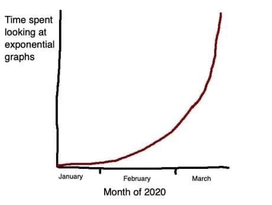

Author:

Steve Simon, PhD

University of Missouri Kansas City School of Medicine

Department of Biomedical and Health informatics

2411 Holmes Street

Kansas City MO 64108

Corresponding Author

Key Words: COVID-19; Compartment modeling; 

**Introduction**

There was a cute meme that was going around on the Internet earlier this year representing the time spent looking at exponential graphs that showed an exponential increase from January to February to March (Figure 1). This was, of course, the time that most of us were learning about how serious the COVID-19 crisis could be. There were a whole host of statistical models that were trying to predict how many people would become infected and how many people would die. These models, at least early on, all showed that dangerous exponential rise in infections.



*Figure 1. Twitter image$^1$*

How do these models work? There are many approaches, but the most common uses some variation of the Susceptible-Infected-Recovered (SIR) compartment model.

**Compartment models**

Think of a compartment as a bucket of water with a hole in the side of the bucket. Water spills out at a certain rate, depending on the size and shape of the hole. The water that spills out of this bucket goes into a second bucket, which also has a hole in the side. This water goes into a third bucket, and so forth.

The compartments represent various disease states. In the simplest model, there are three compartments representing patients that are susceptible (*S*), infected (*I*), and recovered (*R*). The most interesting of these is the *I* compartment. The level in that compartment depends on how quickly it gets filled from the *S* compartment and how quickly it drains into the *R* compartment. You want don’t want the *I* compartment to get too full for many reasons, but mostly because a large number of infected individuals at one time can tax the available health care resources.

```{r, echo=FALSE}
suppressMessages(suppressWarnings(library(knitr)))
suppressMessages(suppressWarnings(library(tidyverse)))
suppressMessages(suppressWarnings(library(usmap)))

knitr::opts_chunk$set(echo=FALSE, fig.width=6, fig.height=3)
```

```{r}
sz <- 1.2
xc <- 20
yc <- 80
xbox <- 10*c(-1, -1,  1,  1, -1) + xc
ybox <- 10*c(-1,  1,  1, -1, -1) + yc
data.frame(x=xbox, y=ybox) %>%
  ggplot(aes(x, y)) +
  expand_limits(x=c(0, 100), y=c(0, 100)) +
  theme_void() +
  geom_path(size=sz) + 
  geom_text(x=xc, y=yc, label="S") +
  geom_path(x=xbox+30, y=ybox-30, size=sz) +
  geom_text(x=xc+30, y=yc-30, label="I") +
  geom_path(x=xbox+60, y=ybox-60, size=sz) +
  geom_text(x=xc+60, y=yc-60, label="R") +
  geom_curve(
    x=xc+40, y=yc-35, xend=xc+55, yend=30, curvature=-0.3, size=sz, 
    arrow = arrow(type = "closed", length=unit(0.15, "inches"))) -> sir_plot
sir_plot +
  geom_curve(
    x=xc+10, y=yc- 5, xend=xc+25, yend=yc-20, curvature=-0.3, size=sz, 
    arrow = arrow(type = "closed", length=unit(0.15, "inches")))
```

*Figure 2. Susceptible-Infected-Recovered (SIR) model*

There is an interesting equation that describes the *I* compartment:

$dI/dt = \beta (S \times I) - \gamma I$

Let's take this equation apart to see what is going on.

First the derivative notation, $dI/dt$ tells you that the model is explaining not the amount in the *I* compartment, but the rate at which the level in the *I* compartment changes. You are unhappy when the rate is postive, as that means the compartment is filling faster than it is draining. If you can turn the rate to a negative value, then the compartment drains faster than it fills.

The term $- \gamma I$ represents the rate at which the compartment drains, and this is a constant $\gamma$ times the amount in the compartment *I*. If $\gamma$ is small, the compartment drains slowly and infectious people stay infectious for a very long time, weeks or maybe months. If $\gamma$ is large, then the compartment drains quickly meaning that infectious people recover very quickly, maybe within a few days.

For most infectious diseases, you do not have any control over $\gamma$. It is controlled by how quickly your body's defenses can beat back the infection.

The term $\beta (S \times I)$ tells you how quickly the compartment is filling, and this is a constant $\beta$ times the product of the amounts in compartment *S* and compartment *I*. You do have a lot of control over this part of the equation.

Since the filling rate is the product of *S* and *I*, the *I* compartment fills fast only when *S* and *I* are both large. If *I* is small, that means that there are not a lot of people around to do the infecting. If *S* is small that means that there are not a lot of people around to get infected.

Typically *I* is small early in the course of a pandemic, and represents the early part of the exponential curve where the disease spreads slowly. Over time, however, *I* may grow and with it the rate at which *I* grows will increase, leading to the undesired exponential increase in infections.

Eventually as the *S* compartment drains into the *I* compartment, *S* will shrink enough so that the product $S \times I$ becomes small again. This represents herd immunity, the setting where the number of people susceptible to infection becomes too small to keep the epidemic going. It is like a forest fire that burns itself out because there is no fuel left to burn.

**Dynamics that avoid an exponential explosion of cases**

Some infections never catch fire and some burn with an exponential fury. The difference between them is controlled by how quickly the Infected compartment fills compared to how quickly it drains. This is controlled by the constants $\beta$ and  $\gamma$. 

Designate $R_0$ as the ratio, $\beta / \gamma$.

This ratio, called the reproductive number, plays a key role in the spread of disease.$^2$ You can interpret this as the average number of people infected by a single individual before they stop being infectious.

If this ratio is less than one, then the *I* compartment drains faster into the *R* compartment than it can get filled by the *S* component. If the ratio $R_0$ is larger than 1, then the *I* compartment fills faster than it can drain. You want to avoid this, if you can.

You make the ratio small by decreasing the numerator, $\beta$ or increasing the denominator, $\gamma$. There is little that you can do to influence $\gamma$. If you could strengthen your immune system so you can rid yourself of the infection faster, that would be great. But therapies to strengthen your immune system are not that easy to come by.

Decreasing $\beta$, on the other hand, can be done. Even if there are a large number of susceptible people and a large number of infected people, you can reduce $\beta$ through policies like masking and social distancing.

**Herd immunity**

Even infections that burn with an exponential fury do not last forever. As the Susceptible compartment drains, the rate at which that compartment fills the Infected compartment has to slow down. 

You can calculate the proportion of patients who are still susceptible at time t, and designate it as $S_t$, Then the reproductive number at time t, $R_t$, can be computed as

$R_t = \beta / (\gamma S_t)$

The infection starts to burn out when  $R_t$ falls below 1.$^3$ This happy state is known as herd immunity.

**Vaccination and re-infection models**

The SIR model is quite flexible and even in its simplest form can accommodate two special cases: vaccination and re-infection. You can incorporate vaccination into the SIR model by adding an additional path that goes directly from the Susceptible compartment to the Recovered compartment, as shown in Figure 1. You need an estimate for the rate of vaccination, either produced by your knowledge of previous vaccination efforts or modelled directly from observed data.

```{r}
sir_plot +
  geom_curve(
    x=xc+10, y=yc- 5, xend=xc+25, yend=yc-20, curvature=-0.3, size=sz, 
    arrow = arrow(type = "closed", length=unit(0.15, "inches"))) +
  geom_curve(
    x=xc+10, y=yc+ 5, xend=xc+60, yend=yc-50, curvature=-0.3, size=sz, 
    arrow = arrow(type = "closed", length=unit(0.15, "inches")))
```

*Figure 3. SIR model with vaccination*

Re-infection is the nightmare scenario where people who recover from the infection can still migrate back to the Susceptible compartment.$^4,5$ This could be due to mutations in the virus or an immune system that "forgets" about the infection over time. For COVID-19, cases of re-infection are rare, but simulations under this bleak scenario show a future where waves of new infection returns repeatedly over time.

```{r}
sir_plot +
  geom_curve(
    x=xc+10, y=yc- 5, xend=xc+25, yend=yc-20, curvature=-0.3, size=sz, 
    arrow = arrow(type = "closed", length=unit(0.15, "inches"))) +
  geom_curve(
    xend=xc+10, yend=yc+ 5, x=xc+60, y=yc-50, curvature= 0.3, size=sz, 
    arrow = arrow(type = "closed", length=unit(0.15, "inches")))
```

*Figure 4. SIR model with vaccination*

**Adding compartments to enhance the SIR model**

The compartment model allows you to add extra layers to more closely model the complex process of disease propogation. You can, for example, add an additional compartment $E$, between the susceptible and infected compartments. The would represent people who were exposed to the virus but who were not yet infectious (Figure 4). The resulting model, an SEIR model, seems simple enough, but the mathematics behind this model becomes quite messy. Part of the problem is that you can't get an accurate count of the number of people in the $E$ compartment, but there are other complexities as well. Fortunately, good mathematical approximations are available for the SEIR model.$^6$

```{r}
sir_plot +
  geom_path(x=xbox, y=ybox-30, size=sz) +
  geom_text(x=xc, y=yc-30, label="E") +
  geom_curve(
    x=xc, y=yc-10, xend=xc, yend=yc-20, curvature=0, size=sz, 
    arrow = arrow(type = "closed", length=unit(0.15, "inches"))) +
  geom_curve(
    x=xc+10, y=yc-30, xend=xc+20, yend=yc-30, curvature=0, size=sz, 
    arrow = arrow(type = "closed", length=unit(0.15, "inches"))) -> seir_plot
seir_plot
```

*Figure 5. Susceptible/Exposed/Infected/Recovered (SEIR) model*

You can also describe multiple paths out of the *I* compartment (Figure 5). Some of the individuals in this compartment be hospitalized (the *H* compartment) and from the hospital, some could recover and some could die (the *D* compartment).

```{r}
seir_plot + 
  geom_path(x=xbox+30, y=ybox-60, size=sz) +
  geom_text(x=xc+30, y=yc-60, label="H") +
  geom_path(x=xbox, y=ybox-60, size=sz) +
  geom_text(x=xc, y=yc-60, label="D") +
  geom_curve(
    x=xc+30, y=yc-40, xend=xc+30, yend=yc-50, curvature=0, size=sz, 
    arrow = arrow(type = "closed", length=unit(0.15, "inches"))) +
  geom_curve(
    x=xc+40, y=yc-60, xend=xc+50, yend=yc-60, curvature=0, size=sz, 
    arrow = arrow(type = "closed", length=unit(0.15, "inches"))) +
  geom_curve(
    x=xc+20, y=yc-60, xend=xc+10, yend=yc-60, curvature=0, size=sz, 
    arrow = arrow(type = "closed", length=unit(0.15, "inches"))) -> seirhd_plot
seirhd_plot
```

*Figure 6. Adding Hospitalized/Death compartments to the SEIR model*

There are many other possible modifications to this model. The additional compartments allow for an increasing amount of sophistication in the predictions.

**How are these models used in practice**

The SIR model and various extensions are helpful in two ways. First, you can take data from an actual infection, and estimate the various rates in a statistical algorithm. This algorithm can then provide predictions about the future course of the infection. How well the model predicts, of course, is dependent on

+ the quality of the data that is fed into the model
+ how well the compartments of the model actually reflect the dynamics of the disease process, and
+ the stability of the model over time.

The other value of the SIR model is in its ability to simulate settings that have not yet been observed. There are curretnly some new mutations of the SARS-CoV2 virus that appear to be more infectious. An adhoc adjustment of $\beta$, the parameter that controls how quickly the $I$ compartment fills from the $S$ compartment, provides a crude estimate of the potential impact of the new mutations. You can also modify the parameters of a vaccination program and simulate its effects on the pandemic.

**Concerns bout the compartment models**

The models themsevles, as noted above, may fail to predict well because of their limitations.

One major concern about compartment models is heterogeneity. The compartment model treats every individual the same. Some people, however, are less likely to get infected than others. Some parts of the country, because of urban crowding, are more likely to see higher rates of infection than other parts of the country. Different demographic groups can also create heterogeneity. You can't treat a population with a mix of ages, gender, and race as if it were a single homogenous group.

Stability is another concern. The compartment models can be thrown off  by important temporal changes such as business shutdowns and reopenings, increased testing, and mandates for masking.

Finally, complexity is an issue. As you add more compartments to a model, you add more equations, and trying to estimate the rates for each path among compartments becomes difficult.

**Solutions that address these concerns**

Several approaches, agent based models, hierarchical models, time varying models, and covariate adjustments have been developed to address these concerns, 

An agent based model replaces buckets of water with individual particles. There particles move around at varying speeds and when an infected particle collides a susceptible particle, the latter also becomes infected. Think of it as a giant simulated game of tag, with the infected people playing the role of "it". You account for heterogeneity by controlling each particle differently. Faster moving particles represent individuals who do not practice social distancing well. You can assign each particle a different level of susceptibility as well, so that some become infected with very high probability after a collision and others become infected with a much lower probability. These models can include other sources of variation, such as changes in social distancing after a lockdown.

Agent based models have been compared to a giant game of the Sims. The number of people in the agent based models, however, is often in the thousands or even millions. Thiough the actual agent based models are quite complex, a simplistic visualization helps in understanding how the model.$^7$

A hierarchical model divides up the country into regions (typically individual counties) and lets each region have a different SIR model. With 3,141 counties, this represents a huge increase in complexity, one that could potentially choke even the fastest computers. The saving grace in these hierarchical models is that you can often rely on the fact that similar regions will behave similarly in the dynamics of the SIR model.

Time is one of the biggest sources of heterogeneity. The spread of an infectious disease changes over time as personal behavior changes and as government interventions change. A time varying model allows the rates at which various compartments fill and empty to gradually change over time. This permits adjustments that reflect changes in social distancing efforts and other factors that can influence the spread of the epidemic.

A covariate is a variable which is not of direct interest, but which can help with prediction. If the covariate can account for some of the variation in the data, it can improve precision and reduce bias.

A model could take the similarities and differences of indivdual counties into account using U.S. Census information (counties with very low population densities should have similar dynamics, for example).

If you have information about when a government shutdown in a county starts or ends, that is an additional covariate that you can use for prediction.

**Concerns about the data sources**

Even the most sophisticated model, however, is dependent on the underlying qulaity of the data. For COVID-19, data is free for the taking, thanks to Johns Hopkins University, the New York Times, USA Facts, and others. If you have more than a little skill in data science, you can build your own model and run it on real data.

There is concern, however, about the raw data. Tests for COVID-19 will sometimes produce false positives and false negatives. There is a lag between when the test is done and when a positive result gets reported. More importantly, not everyone who has an infection will get tested.

You can build a model based on the number of deaths rather than the number of infections. While there are no false positives or negatives on an outcome like death, there is uncertainty on when a death should be associated with COVID-19.

While these are serious problems, they are not new to Epidemiologists. There are ways to adjust models for some types of over and under reporting. When adjustments are not available, there is often the ability to recognize the direction in which these problems will bias the model estimates.

**The Iowa State model**

There are many prediction models available. Here is a brief summary of the model developed at Iowa State.$^8$

The Iowa State model has the three basic compartments, S for susceptible, I for infected, and R for recovered (the paper uses removed instead of recovered), plus a compartment D for deaths. The model predicts the rate of movement between these compartemts individually for each county.

The model used a broad range of covariates (Table 1).

*Table 1. Covariates in the Iowa State model*

+ Geography
  + Longitude
  + Latitude
+ Government  declarations
  + Emergency declarations 
  + School closures 
  + Bans on large gatherings 
  + Limits on bars, restaurants, etc.
  + Travel restrictions
  + Stay-at-home orders
+ County demographics
  + Percent African American
  + Percent Hispanic or Latino
  + Percent aged $\ge$ 65 years 
  + Male-to-female ratio 
  + Population density
  + Socio-economic status
+ Geographic features
  + Latitude
  + Longitude
  + Rural/urban classification
+ County healthcare resources
  + Percent aged less than 65 years without health insurance 
  + Government health care expenditures per capita
  + Total hospital beds per 1,000 population

**What to look for in a pandemic prediction model**

The mathematics for the typical prediction model are difficult to follow, even for experienced researchers, but there are some easily discerned features that you can look for.

First, does the model use standard Epidemiological principles based on the SIR model or some variation? The current COVID-19 pandemic is novel in a quantitative sense. The size and scope of this pandemic have no precedent other than perhaps the Spanish flu outbreak in 1918. Nevertheless, the mechanisms of transmission should not differ qualitatively from other diseases. Models that have predicted those past disease outbreaks well should be expected to perform reasonably well with the current pandemic.

Second, does the model include covariates that are expected to influence rates of transmission in the SIR model? A comprehensive set of covariates can account for the many sources of heterogeneity and will usually produce more precise and less biased predictions.

Third, does the model account for changes over time? A synamic model can capture changes that otherwise might be difficult to measure, such as COVID fatigue.

**Summary**

Prediction is a perilous process. Ask any pollster after the 2020 election results came in. There is, however, great value in attempting to predict future cases and future deaths from an infectious disease like COVID-19. IF you understand how statistical models make these predictions, you can assess the reliability of those estimates. You should be cautious about limitations produced by heterogeneity and the quality of the data underlying these models. Nevertheless, the basic SIR model and extensions have been used to predict past epidemics, especially influenza, whose yearly appearances provide a wealth of data. When done well, these models provide useful predictions for hospitals and public health agencies.

**References**

1. Reuter M. Time Spent Looking at Exponential Graphs. Twitter 2020 (Mar 27). https://twitter.com/michaelreuter/status/1243641396394954755. Accessed January 22, 2021.

2. Ridenhour B, Kowalik JM, Shay DK. Unraveling R0: considerations for public health applications. Am J Public Health. 2014;104(2):e32-e41. doi:10.2105/AJPH.2013.301704.

3. Aronson JK, Brassey J, Mahtani KR. “When will it be over?”: An introduction to viral reproduction numbers, R0 and Re. The Centre for Evidence-Based Medicine 2020 Apr 14. Accessed January 22, 2021.

4. McMahon A, Robb NC. Reinfection with SARS-CoV-2: Discrete SIR (Susceptible, Infected, Recovered) Modeling Using Empirical Infection Data. JMIR Public Health Surveill. 2020;6(4):e21168. Published 2020 Nov 16. doi:10.2196/21168.

5. Malkov E. Simulation of coronavirus disease 2019 (COVID-19) scenarios with possibility of reinfection, Chaos, Solitons & Fractals 2020; 139. doi: 10.1016/j.chaos.2020.110296.

6. Heng K, Althaus CL. The approximately universal shapes of epidemic curves in the Susceptible-Exposed-Infectious-Recovered (SEIR) model. Sci Rep. 2020;10(1):19365. Published 2020 Nov 9. doi:10.1038/s41598-020-76563-8.

7. Stevens H. Why outbreaks like coronavirus spread exponentially, and how to “flatten the curve”. The Washington Post 2020 Mar 14.

8. Wang L, Wang G, Gao L, et al. Spatiotemporal Dynamics, Nowcasting and Forecasting of COVID-19 in the United States. arXiv; 2020.
