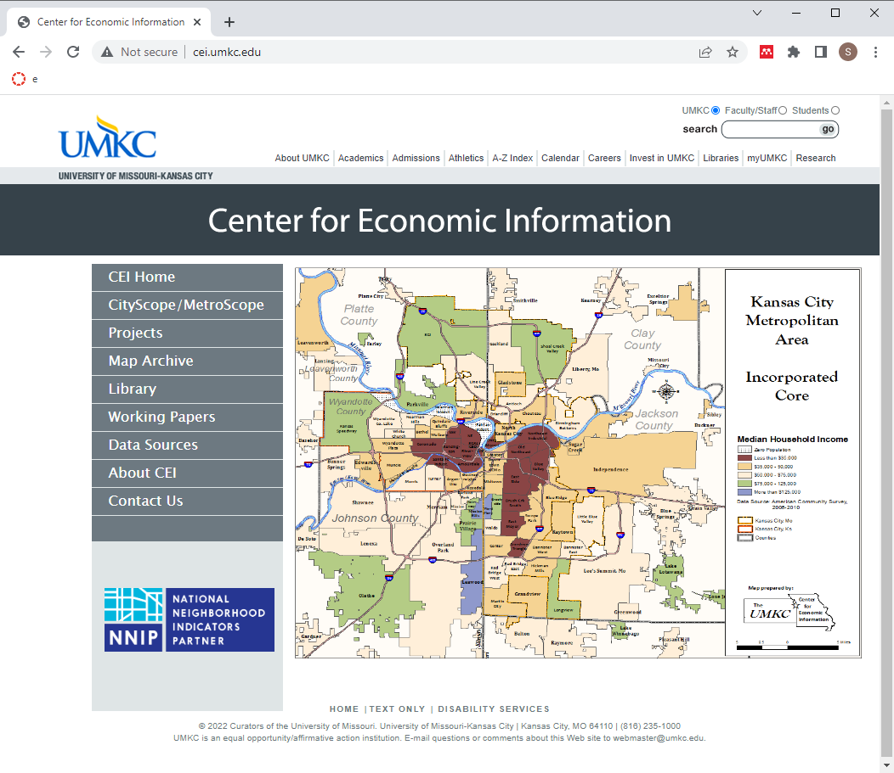
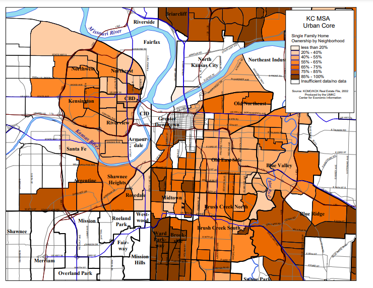

### How this all started

Back in 2018, the new Provost, Mauli Agrawal, convened a series of meetings for a group of people interested in data science. The goal was to talk about new research and teaching activities in this area. At the end of the meeting, Doug Bowles, stopped and talked to me about possibly helping with the work at a group he was running, the Center for Economic Information.

### The Center for Economic Information

The Center for Economic Information was started in 1994 and has worked with neighborhoods and communities in the Kansas City metropolitan area to provide them with data from a variety sources, including the Bureau of the Census.

### Single family home ownership by neighborhood

Here's a map showing single family home ownership by neighborhood.

### Neighborhood housing condition survey (1/2)

+ Fifteen ratings in three categories
  + Structure
  + Grounds
  + Infrastructure
+ Classification of the parcel
  

A major effort of CEI has been their development and validation of the neighborhood housing conditions survey (NHCS). This survey provides ratings for parcels: residential housing and other structures including vacant lots. The survey uses an five point ordinal rating of fifteen elements related to the quality of a housing unit. These address the structure of house itself (such as conditions of the roof, porch, and exterior paint), the grounds around the house (such as the lawn, litter, and open storage) and the  infrastructure (such as the sidewalk, curbs, and street lights).

### Neighborhood housing condition survey (2/2)

+ Evaluation done at the street level
  + IRB review: exempt
    + Observations in a public setting
  + Relatively inexpensive
  + Broad coverage across neighborhoods and years
    + 22 surveys from 2000 through 2014
    + 260,000 homes surveyed
+ Does the home environment influence health?
  + YES!!!
  

CEI researchers in teams of two. The driver went slowly down the street and the researcher riding shotgun entered data on each house along the street.

Because this data collection involved observations in a public setting, the IRB quickly determined that this study was exempt.

It is relatively inexpensive, about $6 per house, when all the costs are accounted for.

The survey provided a ton of data. Over a fifteen year period, CEI collected data on over 260,000 houses.

The home in which you live affects many aspects of your social and economic well being. Can it affect your health as well. The answer is a strong YES!

Much of my early work with CEI involved providing informal support to two students working at CEI. Both produced dissertations that addressed the influence of housing quality on health.

### "An Interdisciplinary Approach to Health Disparities Research and Intervention: The Case of Childhood Asthma in Kansas City"

Natalie Kane, pictured here, wrote a dissertation examining how asthma can be exacerbated by poor housing conditions and other environmental variables such as proximity to point sources of pollution.

She graduated from UMKC in 2020, worked as a post-doc at Children's Mercy under the direction of Mark Hoffman, and is now working for My Sidewalk, an organization helping communities to access data useful for planning and lobbying efforts.

I offered some informal advice about some Bayesian models she was using. She actually had done everything quite well, so my job was mostly explaining how to interpret these models and how to display her results properly.

### "Childhood Lead Poisoning and the Built Environment in Kansas City, Missouri, 2000-2013"

Neal Wilson, pictured here, wrote a dissertation looking at lead poisoning in children. He graduated in 2021 and is currently the Associate Director for CEI. He also teaches Introduction to Economics and Economic History at the California Institute of the Arts.

Like Dr. Kane, Dr. Wilson used a Bayesian model in his research and I provided some informal advice.

### Leveraging existing resources

+ Project Lead Safe Kansas City
  + 20 years of data
  + 18 thousand health encounters per year
+ Exterior based housing survey
  + Quick, easy, cost effective ($6.50 per parcel)
  + Can be done at the street level
  + Extensive quality control procedures
  + Used routinely for over 260 thousand houses over 14 years.

The work we propose takes advantage of two key resources that already exist. The first is data from the Lead Safe Kansas City project. This program, funded by HUD, tests children for lead poisoning, home testing, and remediates if lead hazards are found. There is a massive amount of information from this project, 20 years worth of data and 18 thousand health encounters per year.

The second resource is an exterior based housing survey developed by the Center for Economic Information and used in many Kansas City Missouri and Kansas City Kansas neighborhoods over the past two decades. It can be conducted by graduate students after a carefully established training program. The individual items in the survey, such as roofing condition are easily observed at the street level and can be done quickly and accurately. Our team has built extensive quality control procedures into the survey. It can be done quickly and cheaply. Our team has collected data on over 260 thousand houses over a 14 year period.

### Aim 1. 

+ Quantify improvements made by KC Lead Safe
  + Trends over time versus national trends
  + Identify and evaluate children who move into remediated homes.

We will describe the extent to which different interventions have made housing lead safe by HUD standards and how this leads to fewer lead poisoned children among those who move into a home after remediation activity.

### Aim 2

+ Validate use of exterior survey to identify high risk homes
  + Conduct survey in 60 census tracts
  + Select 50 houses with high score on survey
  + Compare to 50 neighboring control houses

Our agenda is to develop a primary prevention technique based on exterior housing observations as well as neighborhood level social determinants of health. The goal will be to develop a data-driven, housing-based index that Lead Hazard Control programs can use to select the homes most in need of lead-based hazard remediation.

### Strengths of the research

+ Leverage existing resources to solve new problems
+ Use of cost-effective methods
+ Extensive QC already in place
+ Approach easily extended to other communities

we're quite proud of the proposal that we put together and see three major strengths of this research. 

First, we are leveraging existing resources in this research. We have extensive data from the KC Lead Safe project and will use that to evaluate the long term success of lead remediation. We have an established methodology for surveying the exterior conditions of a house and expect that this will be predictive of interior conditions as well.

Second, we are proposing cost effective methods for this work. The exterior conditions survey is fast, convenient, and inexpensive. We hope to show that this simple survey will allow a cost-effective approach to identify where to best spend remediation efforts.

Third, we have detailed quality control procedures already in place for these procedures. There is a detailed training protocol, for example, for the exterior house conditions survey, and duplicate assessment of all survey items.

Finally, if the approach we propose is proven by the research data, it would take very little effort to package up the work and apply it to other communities in the United States.

