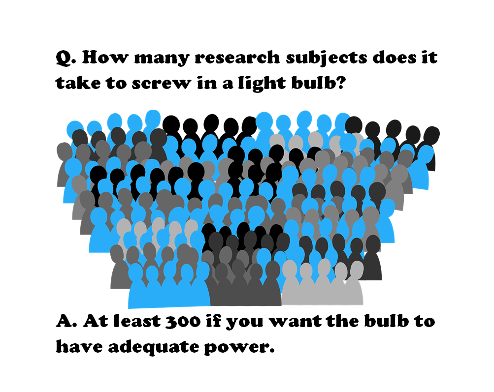
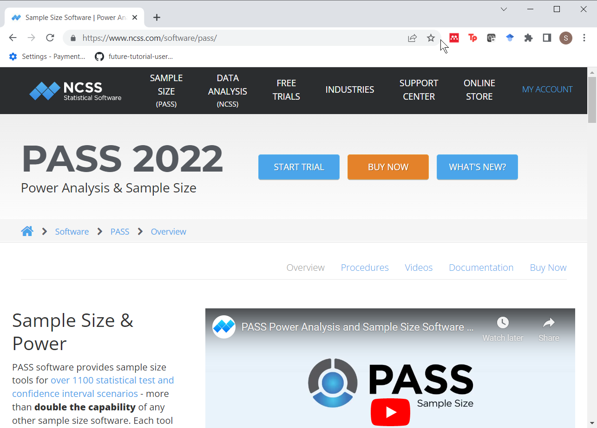
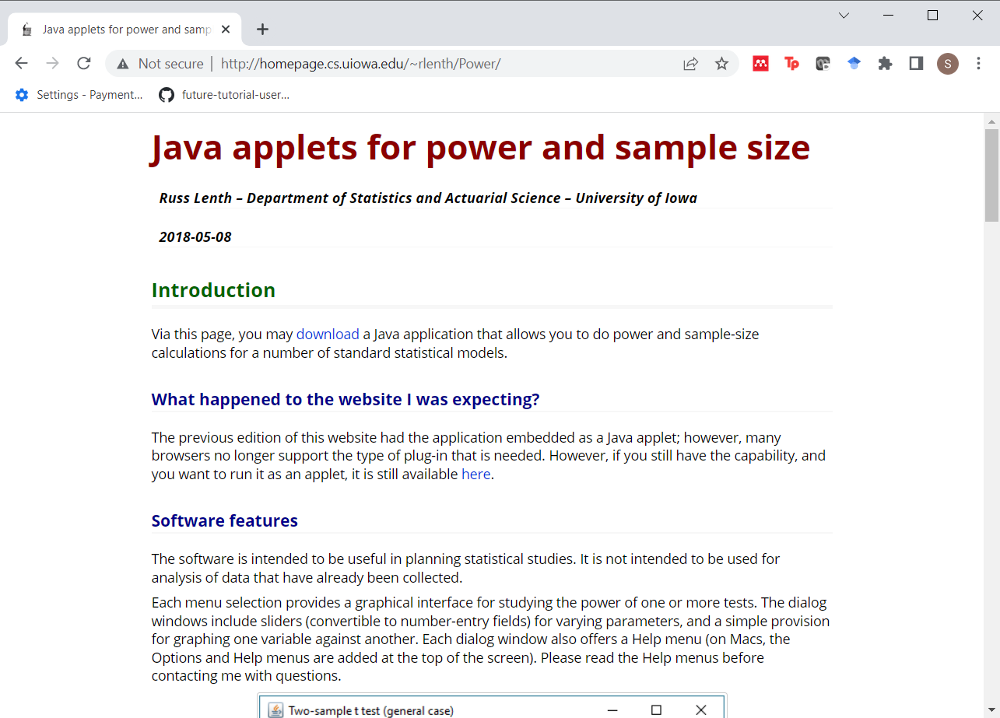
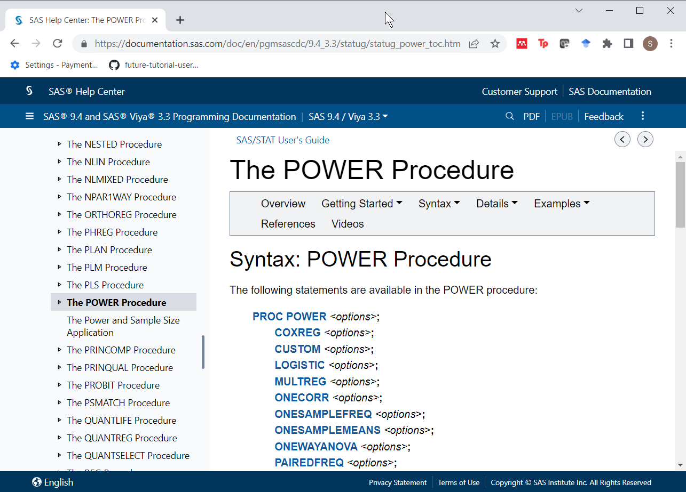

```{r setup, echo=FALSE}
knitr::opts_chunk$set(
  echo=FALSE,
  message=FALSE,
  warning=FALSE)
suppressMessages(
  suppressWarnings(
    library(tidyverse)
  )
)
# Width and height of all graphs
w=6
h=3
```

### How many research subjects...



<div class="notes">

Here's a meme that I tried to create. It got sent to about a dozen people and fizzled out. Oh well. This is a take-off on the classic light bulb joke.

How many research subjects does it take to screw in a light bulb?

At least 300 if you want the bulb to have adequate power.

Actually, that 300 comes from an article on Schizophrenia that I'll talk about in a minute.

</div>

### Definitions

+ $H_0:\ \theta=\theta_0$
+ $H_1:\ \theta \ne \theta_0$
+ $Power = P[Reject\ H_0\ |\ \theta]$

<div class="notes">


</div>

### Three things that you need

+ Research hypothesis
+ Standard deviation of your outcome measure
+ Minimum clinically important difference

### Why are power and sample size calculations important?

+ Fictional research report
  + This is a new and innovative surgical approach and we are 95% confident that the cure rate is somewhere between 3% and 98%.
+ Thornley and Adams review
  + 2,000 studies
  + Target sample size=300
  + Average sample size=65
  + Only 3% met the target sample size
  
<div class="notes">

So to emphasize why power and sample size calculations are so important, I tell a fictional story about a researcher who gets a six-year, ten-million-dollar grant and writes up a final report that says "This is a new and innovative surgical approach and we are 95% confident that the cure rate is somewhere between 3% and 98%."

Even people who don't know much about Statistics get the point of this story. If the best confidence interval that you can produce goes from 3% to 98%, you've just wasted a lot of money. This is an example of where everything is nothing.

A real world example, though a bit dated, comes from a paper by Ben Thornley and Clive Adams that reviewed two thousand research papers on schizophrenia published between 1948 and 1997. They found several problems with most of these studies. They studied the wrong patients, they didn't study them long enough, and they didn't measure them consistently. But just as big a problem was that they did not study enough research subjects. Thornley and Adams did some "back of the envelope" calculations and established that a decent study of schizophrenia should recruit at least 300 patients. But the average study only recruited 65 patients. Even worse, was that only 3% of all the studies met or exceeded the target sample size of 300.

</div>

### Software to calculate power and sample size: PASS



<div class="notes">

There's a lot of good software out there to do power and sample size calculations. One product is PASS, which is an acronym for Power And Sample Size.

</div>

### Software to calculate power and sample size: PiFace



<div class="notes">

Another software program is PiFace. PiFace was written by Russ Lenth. Dr. Lenth recently retired from a teaching position at the University of Iowa. I wrote the first PhD disseration that Dr. Lenth supervised. That was back in 1982. Dr. Lenth got very interested in power and sample size calculations in the early 1990s and wrote some very nice apps. The most recent one, PiFace, is a Java program and it has lots of nice features, such as sliders that allow you to see directly the impact of various changes in sample size affects power or how various changes in power affect sample size.

</div>

### Software to calculate power and sample size: SAS Proc Power



<div class="notes">

I know it will make me unpopular with this audience, but SAS has a very nice set of power and sample size calculation software. It was written by Ralph O'Brien and John Castelloe. Dr. Castelloe wrote the second PhD dissertation that Dr. Lenth supervised. Ralph O'Brien had written some SAS macro programs for power and sample size calculation (UnifyPow) that got integrated into SAS under the name "proc power" with the help of Dr. Castelloe.

</div>

### Other software

+ nQuery advisor

<div class="notes">


</div>

### Software to calculate power and sample size: R

+ 